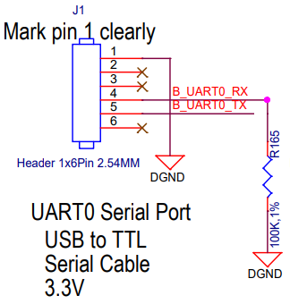
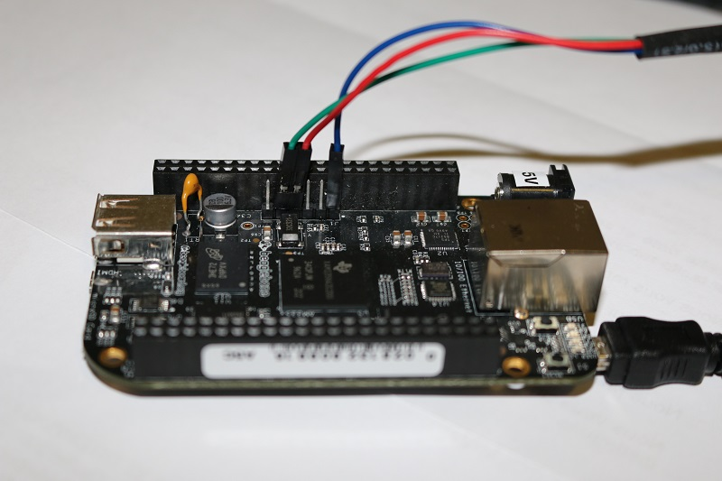

# Bootloader - U-Boot


## Objectives

After this lab you will be able to:

* Set up serial communication with the target board.

* Compile and install the *U-Boot* bootloader.

* Use basic *U-Boot* commands.

* Set up *TFTP* communication with the host machine.


## Required tools

* Our [*cross-compile toolchain*](toolchain.md)

* Ubuntu packages:

    `device-tree-compiler`
    `libssl-dev`
    `parted`
    `picocom`
    `python3-dev`
    `python3-distutils`
    `qemu-system-arm`
    `swig`
    `tftpd-hpa`

    plus those from the previous labs.

* [*Das U-Boot*](https://u-boot.readthedocs.io/), either as:

    * [*git* repository](https://source.denx.de/u-boot/u-boot/)

    * [Source code archive for release `v2022.07`](https://source.denx.de/u-boot/u-boot/-/archive/v2022.07/u-boot-v2022.07.tar.bz2)


* [*BeagleBone Black* board](https://beagleboard.org/black/)

    * Powered via generic USB (5&nbsp;V).

    * Dedicated Ethernet connection.

* A generic *USB-to-UART* cable, *TTL* levels, **3.3&nbsp;V** (do not exceed!), only *TX*/*RX* pins required.

    * [Cable used by the original Bootlin tutorial](https://www.olimex.com/Products/Components/Cables/USB-Serial-Cable/USB-Serial-Cable-F/).


## Bootloader startup

As the *bootloader* is the first piece of software executed by a hardware platform, the installation procedure of the bootloader is very specific to the hardware platform.<br/>
There are usually two cases:

* The processor offers nothing to ease the installation of the bootloader, in which case the *JTAG* has to be used to initialize flash storage and write the bootloader code to flash.
Detailed knowledge of the hardware is of course required to perform these operations.

* The processor offers a *monitor*, implemented in *ROM*, and through which access to the memories is made easier.

The *AM3358* SoC on the *BeagleBone* falls into the second category. The monitor integrated in the ROM reads the SD card to search for a valid bootloader.


## Serial communication

The *BeagleBone* serial connector is exported on *J1* (the 6 pins close to one of the 48 pins headers).
Using your *USB-to-UART* adapter, connect the ground wire (*blue*) to the pin closest to the power supply connector (*pin #1*), and the *adapter TX* (*red*) and *adapter RX* (*green*) wires to the pins 4 (*board RX*) and 5 (*board TX*), respectively.

| Board pin | Board signal | Cable signal | Cable color |
|-----------|--------------|--------------|-------------|
| J1 1      | GND          | GND          | <font color="#008">Blue </font> |
| J1 4      | RX           | TX           | <font color="#800">Red  </font> |
| J1 5      | TX           | RX           | <font color="#080">Green</font> |





After insertion into the USB host, you have to re-assign it to the *VirtualBox* VM, via its menus.

Then, the *Lubuntu* VM should register it into the *host* `/dev/` folder, as `/dev/ttyUSB0` (or similar names for different adapter chips, like `/dev/ttyACM0`, `/dev/ttyAMA0`, *etc.*).

To communicate with the board through the serial port, install a serial communication program, such as `picocom`.

If you run `ls -l /dev/ttyUSB0`, you can also see that only `root` and users belonging to the
`dialout` group have read and write access to the serial console.
Therefore, you need to add your user to the `dialout` group.<br/>
**Important:** for the group change to be effective, you have to reboot your computer (at least on Ubuntu 22.04) and log in again.
A workaround is to run `newgrp dialout`, but it works only within that shell session &mdash; you have to repeat this command for each shell you open, until the next login session.

```console
$ sudo apt install picocom
$ ls -l /dev/ttyUSB0
crw-rw---- 1 root dialout 188, 0 Apr 14 23:33 /dev/ttyUSB0
$ sudo adduser $USER dialout
$ newgrp dialout
```

Run `picocom -b 115200 /dev/ttyUSB0` to start serial communication on `/dev/ttyUSB0`, with a *baud rate* of 115200 baud (the typical speed).<br/>
If you wish to exit `picocom`, press ++ctrl+a++ followed by ++ctrl+x++.

```console
$ picocom -b 115200 /dev/ttyUSB0
picocom v3.1

port is        : /dev/ttyUSB0
flowcontrol    : none
baudrate is    : 115200
parity is      : none
databits are   : 8
stopbits are   : 1
escape is      : C-a
local echo is  : no
noinit is      : no
noreset is     : no
hangup is      : no
nolock is      : no
send_cmd is    : sz -vv
receive_cmd is : rz -vv -E
imap is        :
omap is        :
emap is        : crcrlf,delbs,
logfile is     : none
initstring     : none
exit_after is  : not set
exit is        : no

Type [C-a] [C-h] to see available commands
Terminal ready

Terminating...
Thanks for using picocom
```

There should be nothing on the serial line so far, as the board is not powered up yet.

To speed up typing for reconnection, I suggest a tiny script:

```console
$ sudo cat > /usr/bin/picocomBBB <<'EOF'
#!/bin/sh
picocom -b 115200 /dev/ttyUSB0
EOF
$ chmod +x /usr/bin/picocomBBB
```

This way we can type and run `picocomBBB` instead of the longer command line.

It is now time to power up your board by plugging in the mini-USB (*BeagleBone Black* case) or micro-USB (*BeagleBone Black Wireless* case) cable to your PC.

See what messages you get on the serial line. You should see *U-Boot* start on the serial line, if
there was a valid *U-Boot* and *SPL* on the board’s *eMMC*.

```console
$ picocomBBB
    ...
U-Boot SPL 2019.04-00002-g07d5700e21 (Mar 06 2020 - 11:24:55 -0600)
Trying to boot from MMC2
Loading Environment from EXT4... Card did not respond to voltage select!


U-Boot 2019.04-00002-g07d5700e21 (Mar 06 2020 - 11:24:55 -0600), Build: jenkins-github_Bootloader-Builder-137

CPU  : AM335X-GP rev 2.1
I2C:   ready
DRAM:  512 MiB
No match for driver 'omap_hsmmc'
No match for driver 'omap_hsmmc'
Some drivers were not found
Reset Source: Power-on reset has occurred.
RTC 32KCLK Source: External.
MMC:   OMAP SD/MMC: 0, OMAP SD/MMC: 1
Loading Environment from EXT4... Card did not respond to voltage select!
Board: BeagleBone Black
<ethaddr> not set. Validating first E-fuse MAC
BeagleBone Black:
    ...
```


## Source code

Enter the folder of this lab, that's going to become our main workspace folder:

```console
$ LAB_PATH="$HOME/embedded-linux-bbb-labs/bootloader"
$ cd $LAB_PATH
```

You can now get *U-Boot* at the suggested version (*git* tag `v2022.07`).

> Yes, I used an older version w.r.t *QEMU* (`v2023.01`) because I had some troubles with USB initialization, which requires some investigation (anything deactivated within the recent *defconfig*?)

We're going to clone the *git* repository into the home folder, creating a new *branch* named after the *embedded-linux-bbb* tutorial just for convenience.

```console
$ cd $LAB_PATH
$ git clone "https://source.denx.de/u-boot/u-boot"
$ cd u-boot/
$ label="v2022.07"
$ git checkout -b embedded-linux-bbb $label
```

Alternatively, you can directly unpack an archive of the suggested version. This is usually much faster than cloning a big *git* repository, despite losing all the features of a *git* repository.

```console
$ cd $LAB_PATH
$ label="v2022.07"
$ wget "https://source.denx.de/u-boot/u-boot/-/archive/${label}/u-boot-${label}.tar.bz2"
$ tar xfv "u-boot-${label}.tar.bz2"
$ mv u-boot*/ u-boot
```

## Configuration

Get an understanding of *U-Boot*’s configuration and compilation steps by reading its `README` file, and specifically the *Building the Software* section.

*U-Boot* comes with some sample configuration files for officially supported boards, under the `configs` folder, named with a `_defconfig` suffix.

Our *BeagleBone Black* board is based on an *ARM Cortex A8*, the *Texas Instruments AM335X Sitara*.
Among the officially supported configurations, the one that supports our boars isn't obvious: it's `am335x_evm_defconfig` (generic *AM335 EValuation Module*), not `am335x_boneblack_vboot_defconfig` (only for *verified boot* on our *BBB*). Let's make it effective.

```console hl_lines="5"
$ cd $LAB_PATH/u-boot/
$ ls configs/ | grep am335
am335x_baltos_defconfig
am335x_boneblack_vboot_defconfig
am335x_evm_defconfig
am335x_evm_spiboot_defconfig
am335x_guardian_defconfig
am335x_hs_evm_defconfig
am335x_hs_evm_uart_defconfig
am335x_igep003x_defconfig
am335x_pdu001_defconfig
am335x_shc_defconfig
am335x_shc_ict_defconfig
am335x_shc_netboot_defconfig
am335x_shc_sdboot_defconfig
am335x_sl50_defconfig
phycore-am335x-r2-regor_defconfig
phycore-am335x-r2-wega_defconfig
$ make am335x_evm_defconfig
```

## Build

To build *U-Boot*, we need to specify
[the cross-compile toolchain we built](toolchain.md)
by setting a global variable `CROSS_COMPILE`.<br/>
The `export` keyword makes it available also to sub-processes, including `make` and the tools called by it.
We can choose between the full name `arm-training-linux-uclibcgnueabihf-` or the shortened alias `arm-linux-` as the prefix.<br/>
Also, remmeber to parallelize to save time.

```console
$ TC_NAME="arm-training-linux-uclibcgnueabihf"
$ TC_BASE="$HOME/x-tools/$TC_NAME"
$ export PATH="$TC_BASE/bin:$PATH"
$ export CROSS_COMPILE=arm-linux-
$ export MAKEFLAGS=-j$(nproc)
```

We're going to use the `menuconfig` to refine the configuration to suit our needs.
The default configuration is fine for our needs, so you don't need any fine tuning, but you can take a look around.

```console
$ cd $LAB_PATH/u-boot/
$ make menuconfig
```

> See: [`menuconfig`](../kb/menuconfig.md)

You can now `<Save>` (if needed) and make a backup copy of this configuration:

```console
$ cp .config ../u-boot.config
```

Install some packages required for compilation:

```console
$ sudo apt install  \
  device-tree-compiler libssl-dev parted  \
  python3-dev python3-distutils swig
```

You can now build the bootloader.
You have to pass the `DEVICE_TREE` environment variable to `make`, to select which *Device Tree* has to be compiled: `am335x-boneblack` for the standard *BBB* (covered by this course).<br/>
Alternatively, if you wish to run just `make`, specify our board’s device tree name on `Device Tree Control` &rarr; `Default Device Tree for DT Control` option (`DEFAULT_DEVICE_TREE`, which defaults to `am335x-evm`).

```console
$ make DEVICE_TREE=am335x-boneblack
```

This generates several binaries, including `MLO` and `u-boot.img`.<br/>
You can save them into a backup archive if you wish so:

```console
$ tar cfJv ../u-boot.tar.xz MLO u-boot.img
```


## Bootable SD card

The *TI AM335 romcode* will look for an `MLO` file (*MMC Load*) in a *FAT* partition on an SD card.
This is precisely what *U-Boot* compiled for us, together with the *U-Boot* binary image `u-boot.img`.<br/>
Let’s prepare an SD card with such a partition.

Plug the micro-SD card into your workstation. Ignore any actions by the file manager, so that no partitions are *mounted* automatically.

> If using *Windows* as the *host OS*, the SD card might become corrupted upon insertion, because *Windows* wants to do its own business with it, messing up with partition data.
This involves more operations w.r.t. a native *Linux host OS* as explained within the *Bootlin* tutorials, so let me add my procedures in quoted blocks like this one.
>
> Instead of using the native SD card reader built into my laptop, I'm connecting via a generic *USB SD card reader*.<br/>
> I insert the USB reader itself, without SD card, and pass control of this USB peripheral to *VirtualBox*.

Type the `sudo dmesg` command to see which device is used by your workstation. In case the device is `/dev/mmcblk0`, you will see something like in the following example.<br/>
Let's assign this name to a variable to be used afterwards.

```console
$ sudo dmsg
    ...
[46939.425299] mmc0: new high speed SDHC card at address 0007
[46939.427947] mmcblk0: mmc0:0007 SD16G 14.5 GiB
    ...
$ SDCARD_DEV="/dev/mmcblk0"
$ SDCARD_DEVP="${SDCARD_DEV}p"
```

> With an USB SD card reader, the device is usually a *SCSI*-like device (<code>/dev/sd<i><b>X</b></i></code>).
> In my *Lubuntu* VM, it's named `/dev/sdd`.<br/>
> You can confirm your device was added to the device list, for exmaple via `lsusb` and `dmesg`.
> ```console title="Lubuntu VM" hl_lines="2 8 14 15 19"
> $ lsusb
> Bus 001 Device 004: ID 14cd:1212 Super Top microSD card reader (SY-T18)
> Bus 001 Device 001: ID 1d6b:0002 Linux Foundation 2.0 root hub
> Bus 002 Device 002: ID 80ee:0021 VirtualBox USB Tablet
> Bus 002 Device 001: ID 1d6b:0001 Linux Foundation 1.1 root hub
> $ sudo dmesg
>     ...
> [ 6793.824496] usb 1-1: new high-speed USB device number 4 using ehci-pci
> [ 6794.202112] usb 1-1: New USB device found, idVendor=14cd, idProduct=1212, bcdDevice= 1.00
> [ 6794.202116] usb 1-1: New USB device strings: Mfr=1, Product=3, SerialNumber=2
> [ 6794.202117] usb 1-1: Product: Mass Storage Device
> [ 6794.202119] usb 1-1: Manufacturer: Generic
> [ 6794.202120] usb 1-1: SerialNumber: 121220160204
> [ 6794.205731] usb-storage 1-1:1.0: USB Mass Storage device detected
> [ 6794.205991] scsi host5: usb-storage 1-1:1.0
> [ 6795.232504] scsi 5:0:0:0: Direct-Access     Mass     Storage Device   1.00 PQ: 0 ANSI: 0 CCS
> [ 6795.233040] sd 5:0:0:0: Attached scsi generic sg4 type 0
> [ 6795.252766] sd 5:0:0:0: [sdd] Media removed, stopped polling
> [ 6795.272180] sd 5:0:0:0: [sdd] Attached SCSI removable disk
>     ...
> $ SDCARD_DEV="/dev/sdd"
> $ SDCARD_DEVP="${SDCARD_DEV}"
> ```
>
> Only now you can insert the micro-SD card into the USB reader.

Type the `mount` command to check your currently mounted partitions.
If any of its SD partitions are mounted, unmount them.

```console
$ sudo umount ${SDCARD_DEVP}*
```

We'll erase the existing partition table by simply *zero*-ing the first 16 MiB of the SD card:

```console
$ sudo dd if=/dev/zero of=$SDCARD_DEV bs=1M count=16
```

Now, let’s call the `cfdisk` command to create the partitions that we are going to use.

```
$ sudo cfdisk $SDCARD_DEV
```

If `cfdisk` asks you to `Select a label type`, choose `dos`, as we don’t really need a `gpt` partition table for our labs.

In the `cfdisk` interface, create three *primary* partitions, starting from the beginning, with the following properties:

* One partition, 64 MB big, with the `W95 FAT32 (LBA)` partition type (`c` choice).<br>
  Mark this partition as *bootable*.

* One partition, 32 MB big, that will be used for the root filesystem.<br/>
  Due to the geometry of the device, the partition might be larger, but it does not matter.<br/>
  Keep the `Linux` partition type.

* One partition filling the remaining space of the SD card image, to be used for the data filesystem.<br/>
  Keep the `Linux` partition type.

Select `Write` when you are done.

> You could've done something similar with a single `parted` issue:
>
> ```console
> $ parted $SDCARD_DEV --  \
>     mklabel msdos  \
>     mkpart primary boot fat32 1m 64m  \
>     mkpart primary root ext4 64m 96m  \
>     mkpart primary data ext4 96m -1s  \
>     set 1 boot on
> ```

We will create further partitions in a later lab, when we need them.<br/>
To make sure that partition definitions are reloaded by your workstation, remove the micro-SD card and insert it again, or run `partprobe`.

Now create a *FAT32* filesystem on this new first partition:

```console
$ sudo partprobe
$ sudo mkfs.vfat -a -F 32 -n boot "${SDCARD_DEVP}1"
mkfs.fat 4.2 (2021-01-31)
mkfs.fat: Warning: lowercase labels might not work properly on some systems
```

> *Ubuntu* uses version `4.2` of `mkfs.vfat`, and the *FAT* generated by this version of the command is incompatible with what the *TI AM335x* romcode expects.<br/>
> Passing the `-a` option is workaround described on a [Bootlin blog post](https://bootlin.com/blog/workaround-for-creating-bootable-fat-partition-for-beagle-bone-am335x-on-recent-distros/).

You can now make your workstation automatically mount this partition by removing the micro-SD card and plugging it back. It should now be mounted on `/media/$USER/boot/`.

Now, copy the `MLO` and `u-boot.img` files to the SD card:

```console
$ cd "$LAB_PATH/u-boot/"
$ sdcard_mnt="/media/$USER/boot/"
$ sudo mkdir -p $sdcard_mnt
$ sudo mount -t vfat "${SDCARD_DEVP}1" $sdcard_mnt
$ sudo cp MLO u-boot.img $sdcard_mnt
$ sudo umount $sdcard_mnt
$ sudo rmdir $sdcard_mnt
```

You can now remove the micro-SD card from the *host* workstation.

> You should always remove the micro-SD card from the USB reader **before** un-plugging the USB reader (or before releasing it from the *Lubuntu* VM).<br/>
> If *Windows* takes control of the USB reader with the micro-SD card still inserted, *Windows* might corrupt the boot partition, making it unusable by the *TI AM335 romcode*.


## Quick test

Remove power from *BBB*, connect the UART cable, insert the micro-SD card, and run `picocomBBB` in advance.<br/>
Be ready to press a key (e.g. ++space++) as soon as the board boots, just after the next instructions.

```console
$ picocomBBB
    ...
Terminal ready
```

To boot the board on the external micro-SD card, you need to press and hold the *USER button* (`S2`, close to the USB host port), and then power-up the board. You can then release the *USER button*.

> This seems like a very inconvenient way of booting the board, but the selection of attempting to boot from the external micro-SD card remains active across resets, until the board is ultimately powered off. So, you will just need to use the button a few times during the course.
>
> If this is too inconvenient for you, you could use *U-Boot* on the external micro-SD card to flash a new version of *U-Boot* on the internal *eMMC*. This would allow you to boot without an external micro-SD card.

Here’s what you should get on the serial line:

``` title="picocomBBB - U-Boot"
U-Boot SPL 2022.07 (Apr 16 2023 - 15:43:05 +0200)
Trying to boot from MMC1


U-Boot 2022.07 (Apr 16 2023 - 15:43:05 +0200)

CPU  : AM335X-GP rev 2.1
Model: TI AM335x BeagleBone Black
DRAM:  512 MiB
Core:  160 devices, 18 uclasses, devicetree: separate
WDT:   Started wdt@44e35000 with servicing (60s timeout)
NAND:  0 MiB
MMC:   OMAP SD/MMC: 0, OMAP SD/MMC: 1
Loading Environment from FAT... Unable to read "uboot.env" from mmc0:1...
<ethaddr> not set. Validating first E-fuse MAC
Net:   eth2: ethernet@4a100000, eth3: usb_ether
Hit any key to stop autoboot:  0
=>
```

Make sure that the version and compile date are right. Otherwise, try again, because this means that you booted on the internal *eMMC*.

In *U-Boot*, type the `help` command, and explore the few commands available.

``` title="picocomBBB - U-Boot"
=> help
?         - alias for 'help'
  ...
version   - print monitor, compiler and linker version
```


## Adding commands to U-Boot

Check whether the `config` command is available. This command allows to dump the configuration
settings *U-Boot* was compiled from.
If it’s not, go back to *U-Boot* configuration and enable it.

```console
$ cd "$LAB_PATH/u-boot/"
$ make menuconfig
```

Let's search `config` (press ++slash++ and enter `config`).
You should obtain a list like:

``` hl_lines="1 6"
Symbol: CMD_CONFIG [=n]
Type  : bool
Prompt: config
  Location:
    -> Command line interface
(1)   -> Info commands
  Defined at cmd/Kconfig:138
  Selects: BUILD_BIN2C [=n]


Symbol: CMD_EECONFIG [=n]
Type  : bool
Prompt: Enable the 'econfig' command
  Location:
(2) -> ARM architecture
  Defined at board/gateworks/gw_ventana/Kconfig:15
  Depends on: ARM [=y] && ARCH_MX6 [=n] && TARGET_GW_VENTANA [=n]

    ...
```

Option marked `(1)` (`CMD_CONFIG`) looks like what we need. Press ++1++ then ++y++ to enable it.<br/>
After you `<Exit>` once, you should confirm that your setting was applied.

You can also select the default board, as mentioned in the previous paragraphs, so that we don't need to pass the `DEVICE_TREE` option to `make` anymore.<br/>
Let's search `DEFAULT_DEVICE_TREE` and set it according to your board (*e.g.* `am335x-boneblack`).

You can then `<Save>` into `.config` and exit the program.<br/>
Save a backup and build again.

```console
$ cp .config ../u-boot-config.config
$ make
$ tar cfJv ../u-boot-config.tar.xz MLO u-boot.img
```

You should update the bootloader on the SD card, so you can test that the command is now available and working as expected.

> If you are on a *Windows host OS*, always remember to insert and remove the SD card from the *USB SD card reader* while the USB reader is under control of the *Lubuntu* VM.<br/>
> If *Windows* takes control of the USB reader with the micro-SD card still inserted, *Windows* might corrupt the boot partition, making it unusable by the *TI AM335 romcode*.

```console
$ sudo umount ${SDCARD_DEVP}*
$ cd "$LAB_PATH/u-boot/"
$ sdcard_mnt="/media/$USER/boot/"
$ sudo mkdir -p $sdcard_mnt
$ sudo mount -t vfat "${SDCARD_DEVP}1" $sdcard_mnt
$ sudo cp MLO u-boot.img $sdcard_mnt
$ sudo umount $sdcard_mnt
$ sudo rmdir $sdcard_mnt
```

Running the updated micro-SD card on the *BBB*:

``` title="picocomBBB - U-Boot" hl_lines="1 5 18"
U-Boot SPL 2022.07 (Apr 16 2023 - 15:54:05 +0200)
Trying to boot from MMC1


U-Boot 2022.07 (Apr 16 2023 - 15:54:05 +0200)

CPU  : AM335X-GP rev 2.1
Model: TI AM335x BeagleBone Black
DRAM:  512 MiB
Core:  160 devices, 18 uclasses, devicetree: separate
WDT:   Started wdt@44e35000 with servicing (60s timeout)
NAND:  0 MiB
MMC:   OMAP SD/MMC: 0, OMAP SD/MMC: 1
Loading Environment from FAT... Unable to read "uboot.env" from mmc0:1...
<ethaddr> not set. Validating first E-fuse MAC
Net:   eth2: ethernet@4a100000, eth3: usb_ether
Hit any key to stop autoboot:  0
=> config
#
# Automatically generated file; DO NOT EDIT.
# U-Boot 2022.07 Configuration
#

#
# Compiler: arm-linux-gcc (crosstool-NG 1.25.0.95_7622b49) 11.3.0
#
CONFIG_CREATE_ARCH_SYMLINK=y
    ...
# CONFIG_TOOLS_MKEFICAPSULE is not set
```

As you can see, the `config` command prints *verbatim* the content of the `.config` file that was used to build *U-Boot*.


## Test environment

In the *U-Boot prompt*, make sure that you can set an environment variable:

``` title="picocomBBB - U-Boot"
=> setenv foo bar
=> printenv foo
foo=bar
```

Run `reset` to reboot the board, and then check that the `foo` variable is still set:

``` title="picocomBBB - U-Boot"
=> reset
    ...
Hit any key to stop autoboot:  0
=> printenv foo
## Error: "foo" not defined
```

Environment variables need to be saved across resets!<br/>
This time, call `saveenv` before resetting:

``` title="picocomBBB - U-Boot"
=> setenv foo bar
=> saveenv
Saving Environment to FAT... OK
=> reset
   ...
Hit any key to stop autoboot:  0
=> printenv foo
foo=bar
```


## Networking

To load a kernel in the next lab, we have to setup networking between the *host* machine and the *target* machine.

> See [Host VM - Networking](virtualbox.md#networking) for information about the IP addresses for this lab.

On the *U-Boot* command line, you have to configure the environment variables for networking:
`serverip` for the *host* (*server*) machine, and `ipaddr` for the *target* machine, using the dedicated *Ethernet* port (`eth2`) as the first (`ethprime`).<br/>
To make these settings permanent, save the environment.

``` title="picocomBBB - U-Boot"
=> setenv ethprime eth2
=> setenv serverip 192.168.0.15
=> setenv ipaddr 192.168.0.69
=> saveenv
```

You can now test the connection to the host:

``` title="picocomBBB - U-Boot"
=> ping $serverip
link up on port 0, speed 100, full duplex
Using ethernet@4a100000 device
host 192.168.0.15 is alive
```


## TFTP server

Let’s install a *TFTP* server on your *host* machine*, by the `tftpd-hda` package.

```console
$ sudo apt install tftpd-hpa
$ sudo systemctl restart tftpd-hpa
```

By default, files are stored under the `/srv/tftp/` folder, which should be accessible by the by `tftp` group.<br/>
So, let's add our user to it.

```console
$ sudo mkdir -p /srv/tftp
$ sudo chown -R tftp:tftp /srv/tftp
$ sudo chmod g+rw /srv/tftp/
$ sudo adduser $USER tftp
$ newgrp tftp
```

> The `newgrp tftp` command makes this group available to the current shell without restarting the *host* login session.
> Until the next login session, you have to type this command again for any new shells of the current login session.

To test the TFTP connection, put a small text file in the directory exported through TFTP on your *host* machine, then try to read it back as a TFTP client to check that the server is working properly.

```console
$ echo "Hello, World!" > /srv/tftp/textfile.txt
$ cd $LAB_PATH
$ tftp localhost -v -c get textfile.txt
Connected to localhost (::1), port 69
getting from localhost:textfile.txt to textfile.txt [netascii]
Received 15 bytes in 0.0 seconds [6306 bit/s]
$ cat textfile.txt
Hello, World!
```

Back in *U-Boot* run `bdinfo`, which allows finding out that the *DRAM* starts at `0x80000000`.

``` title="picocomBBB - U-Boot" hl_lines="4 21"
=> bdinfo
boot_params = 0x80000100
DRAM bank   = 0x00000000
-> start    = 0x80000000
-> size     = 0x20000000
flashstart  = 0x00000000
flashsize   = 0x00000000
flashoffset = 0x00000000
baudrate    = 115200 bps
relocaddr   = 0x9ff65000
reloc off   = 0x1f765000
Build       = 32-bit
current eth = ethernet@4a100000
ethaddr     = 54:4a:16:be:9e:ae
IP addr     = 192.168.0.69
fdt_blob    = 0x9df2fc00
new_fdt     = 0x9df2fc00
fdt_size    = 0x000152a0
lmb_dump_all:
 memory.cnt  = 0x1
 memory[0]      [0x80000000-0x9fffffff], 0x20000000 bytes flags: 0
 reserved.cnt  = 0x1
 reserved[0]    [0x9df2b9b8-0x9fffffff], 0x020d4648 bytes flags: 0
devicetree  = separate
arch_number = 0x00000000
TLB addr    = 0x9fff0000
irq_sp      = 0x9df2fbf0
sp start    = 0x9df2fbe0
Early malloc usage: 8f8 / 2000
```

Therefore, we will use the `0x81000000` address to test `tftp`, which is part of the board *DRAM*.<br/>
If you want to check where this value comes from, you can check the
[*AM335x and AMIC110 Sitara™ Processors Technical Reference Manual*](https://www.ti.com/lit/ug/spruh73q/spruh73q.pdf); it’s a big document (more than 5000 pages).
In this document, look for *ARM Cortex-A8 Memory Map* and you will find the SoC memory map.
You can see that the address range for the memory controller (*EMIF0 SDRAM*) starts at the address we are looking for.
You can also try with other values in the RAM address range.

From the *U-Boot* prompt, ask the TFTP server that file:

``` title="picocomBBB - U-Boot" hl_lines="1-2"
=> setenv ram_app_start 0x81000000
=> tftp $ram_app_start textfile.txt
link up on port 0, speed 100, full duplex
Using ethernet@4a100000 device
TFTP from server 192.168.0.15; our IP address is 192.168.0.69
Filename 'textfile.txt'.
Load address: 0x81000000
Loading: ##################################################  14 Bytes
         1000 Bytes/s
done
Bytes transferred = 14 (e hex)
```

The `tftp` command should have downloaded `textfile.txt` from your development workstation into the board’s memory at location `0x81000000`.<br/>
You can verify that the download was successful by dumping the contents of the memory (`md`, *memory dump*):

``` title="picocomBBB - U-Boot" hl_lines="2"
=> md $ram_app_start
81000000: 6c6c6548 57202c6f 646c726f 00000a21  Hello, World!...
81000010: 00000000 00000000 00000000 00000000  ................
81000020: 00000000 00000000 00000000 00000000  ................
81000030: 00000000 00000000 00000000 00000000  ................
81000040: 00000000 00000000 00000000 00000000  ................
81000050: 00000000 00000000 00000000 00000000  ................
81000060: 00000000 00000000 00000000 00000000  ................
81000070: 00000000 00000000 00000000 00000000  ................
81000080: 00000000 00000000 00000000 00000000  ................
81000090: 00000000 00000000 00000000 00000000  ................
810000a0: 00000000 00000000 00000000 00000000  ................
810000b0: 00000000 00000000 00000000 00000000  ................
810000c0: 00000000 00000000 00000000 00000000  ................
810000d0: 00000000 00000000 00000000 00000000  ................
810000e0: 00000000 00000000 00000000 00000000  ................
810000f0: 00000000 00000000 00000000 00000000  ................
```

You can now disconnect and turn off the board.


## Backup and restore

If you have trouble generating binaries that work properly, or later make a mistake that causes you to lose your bootloader binary, you can find a working version under `$LAB_PATH/data/`, to be copied to `$LAB_PATH/u-boot/`:

```console
$ cd $LAB_PATH
$ mkdir -p u-boot/
$ cp data/u-boot u-boot/u-boot
```


## Licensing

This document is an extension to: [*Embedded Linux System Development - Practical Labs - BeagleBone Black Variant*](https://bootlin.com/doc/training/embedded-linux-bbb/)
 &mdash; &copy; 2004-2023, *Bootlin* [https://bootlin.com/](https://bootlin.com), [`CC-BY-SA-3.0`]((https://creativecommons.org/licenses/by-sa/3.0/)) license.

