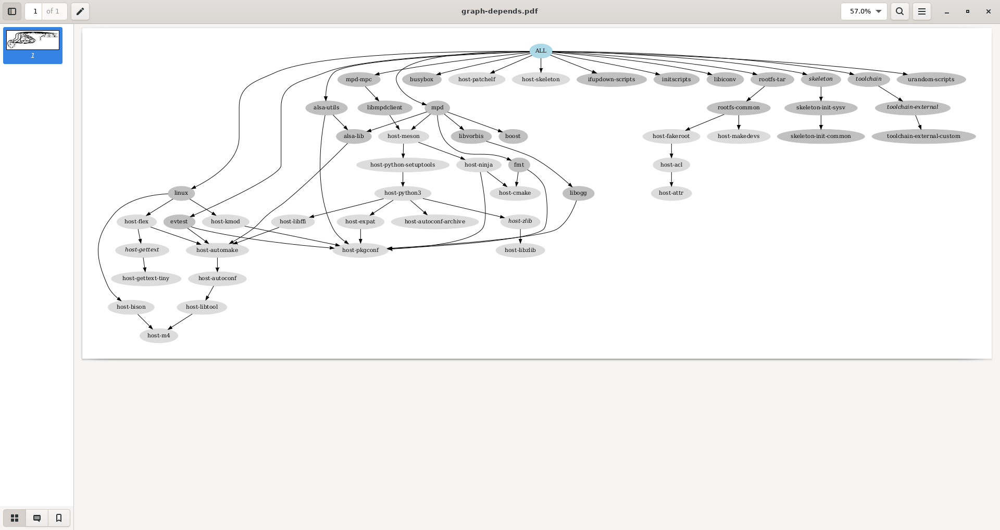

# Buildroot


## Objectives

* discover how a build system is used and how it works, with the example of the Buildroot build system.

Compared to the previous lab, we are going to build a more elaborate system, still containing `alsa-utils` (and of course its `alsa-lib` dependency), but this time using *Buildroot*, an automated build system.

The automated build system will also allow us to add more packages and play real audio on our system, thanks to the [*Music Player Daemon* (`mpd`)](https://www.musicpd.org/) and its `mpc` client.


## Required tools

* Our [*cross-compile toolchain*](toolchain.md)

* Ubuntu packages:

    `evince`
    `graphviz`

    plus those from the previous labs.

* [*Buildroot*](https://buildroot.org/), either as:

    * [*git* repository](https://git.buildroot.net/buildroot/) tag `v2022.02`

    * [Source code archive for release `v2022.02`](https://git.buildroot.net/buildroot/snapshot/buildroot-2022.02.tar.bz2)


## Source code

The official *Buildroot* website is available at [https://buildroot.org/](https://buildroot.org/).<br/>
Let's clone the *git* repository, branching the `2022.02` release, which is a *LTS* (*Long Term Support*, we're just sticking to the original one), naming after this lab.

```console
$ LAB_PATH="$HOME/embedded-linux-bbb-labs/buildroot"
$ cd $LAB_PATH
$ label="2022.02"
$ git clone https://git.buildroot.net/buildroot/
$ cd buildroot/
$ git checkout -b embedded-linux-bbb $label
```

Alternatively, you can download an archived version.

```console
$ LAB_PATH="$HOME/embedded-linux-bbb-labs/buildroot"
$ cd $LAB_PATH
$ label="2022.02"
$ wget "https://git.buildroot.net/buildroot/snapshot/buildroot-${label}.tar.bz2"
$ tar xfv "buildroot-${label}.tar.bz2"
$ mv buildroot*/ buildroot
$ cd buildroot/
```

Several subdirectories or files are visible. The most important ones are:

* `boot` contains the *Makefiles* and configuration items related to the compilation of common bootloaders (*GRUB*, *U-Boot*, *Barebox*, etc.)

* `board` contains board specific configurations and *root* filesystem *overlays*.

* `configs` contains a set of predefined configurations, similar to the concept of *defconfig* in the kernel.

* `docs` contains the documentation for *Buildroot*.

* `fs` contains the code used to generate the various *root* filesystem image formats.

* `linux` contains the *Makefile* and configuration items related to the compilation of the Linux kernel.

* `Makefile` is the main *Makefile* that we will use to use *Buildroot*: everything works through *Makefiles* in Buildroot;

* `package` is a directory that contains all the *Makefiles*, patches, and configuration items to compile the *user space* applications and libraries of your embedded Linux system.<br/>
  Have a look at various subdirectories and see what they contain.

* `system` contains the root filesystem skeleton and the *device tables* used for a static `/dev`.

* `toolchain` contains the *Makefiles*, patches and configuration items to generate the cross-compiling toolchain.


## Configuration

As we will want Buildroot to build a kernel with a custom configuration, and our custom patch, let's add our own subdirectory under `board`.<br/>
Then, copy our kernel configuration ([latest](blockfs.md)) and kernel patch ([latest](hardware.md)).

```console
$ cd "$LAB_PATH/buildroot/"
$ mkdir -p board/bootlin/training/
$ cp ../../tinysystem/kernel-blockfs.config  board/bootlin/training/linux.config
$ cp ../../hardware/0001-Custom-DTS-for-Bootlin-lab.patch  board/bootlin/training/
```

In our case, we would like to:

* Generate an embedded Linux system for ARM.

* Use an already existing external toolchain instead of having *Buildroot* generating one for us.

* Compile the Linux kernel and deploy its modules in the *root* filesystem.

* Integrate *BusyBox*, `alsa-utils`, `mpd`, `mpc` and `evtest` in our embedded Linux system.

* Integrate the target filesystem into a *tarball*.

To run the configuration utility of *Buildroot*, simply run:

```console
$ make menuconfig
```

Set the following options. Don't hesitate to press the `Help` button whenever you need more details about a given option!


In `Target options`:

* `Target Architecture` = `ARM (little endian)`.

* `Target Architecture Variant` = `cortex-A8`.

* `Target ABI` = `EABIhf`.

* `Floating point strategy` = `VFPv3-D16`.


In `Toolchain`:

* `Toolchain type` = `External toolchain`.

* `Toolchain` = `Custom toolchain`.

* `Toolchain path` = `$(HOME)/x-tools/arm-training-linux-uclibcgnueabihf`, which is the one we built.

* `External toolchain gcc version` = `11.x`.

* `External toolchain kernel headers series` = `5.15.x`.

* `External toolchain C library` = `uClibc/uClibc-ng`.

* Enable `Toolchain has WCHAR support?`.

* Enable `Toolchain has SSP support?`.

* Enable `Toolchain has C++ support?`.


In `Kernel`:

* Enable `Linux Kernel`.

* `Kernel version` = `Latest version (5.15)`.

* `Custom kernel patches` = `board/bootlin/training/0001-Custom-DTS-for-Bootlin-lab.patch`,
  our hand-made patch.

* `Kernel configuration` = `Using a custom (def)config file`.

* `Configuration file path` = `board/bootlin/training/linux.config`.

* Enable `Build a Device Tree Blob (DTB)`.

* `In-tree Device Tree Source file names` = `am335x-boneblack-custom`.


In `Target packages`:

* Keep `BusyBox (default version)` and keep the *BusyBox* configuration proposed by *Buildroot*.

* Under `Audio and video applications`:

    * Enable `alsa-utils`, and in the submenu:

        * Only keep `speaker-test`.

    * Enable `mpd`, and in the submenu:

        * Keep only `alsa`, `vorbis` and `tcp sockets`.

    * Enable `mpd-mpc`.

* Under `Hardware handling`:

    * Enable `evtest`.<br/>
      This userspace application allows to test events from input devices.
      This way we will be able to test the *Nunchuk* by getting details about which buttons were pressed.


In `Filesystem images`:

* Enable `tar the root filesystem`.


Exit the `menuconfig` interface saving into the usual `.config` file. Also make a backup copy for reference.

```console
$ cp .config ../buildroot.config
```


## Build

Just run the canonical `make`:

```console
$ make
```

*Buildroot* will first create a small environment with the external toolchain, then download,
extract, configure, compile, and install each component of the embedded system.

All the compilation has taken place in the `output/` subdirectory. Let's explore its content:

* `build` is the directory in which each component built by *Buildroot* is extracted, and where the build actually takes place.

* `host` is the directory where *Buildroot* installs some components for the host.<br/>
  As *Buildroot* doesn't want to depend on too many things installed in the developer machines, it installs some tools needed to compile the packages for the target.<br/>
  In our case it installed `pkg-config` (since the version of the host may be ancient) and tools to generate the root filesystem image (`genext2fs`, `makedevs`, `fakeroot`).

* `images` which contains the final images produced by *Buildroot*. In our case it contains a *tarball* of the filesystem, called `rootfs.tar`, plus the compressed kernel and *DTB* (*Device Tree Binary*).<br/>
  Depending on the configuration, there could also a bootloader binary or a full SD card image.

* `staging`, which contains the "build" space of the target system, all the target libraries, with headers and documentation.<br/>
  It also contains the system headers and the C library, which in our case have been copied from the cross-compiling toolchain.

* `target` is the target *root* filesystem. All the applications and libraries, usually *stripped*, are
installed in this directory.<br/>
  However, it cannot be used directly as the *root* filesystem, as all the device files are missing: it is not possible to create them without being *root*, and *Buildroot* has a policy of not running anything as *root*.


## Run the generated system

Go back to the `$HOME/embedded-linux-bbb-labs/buildroot/` directory.<br/>
Create a new `nfsroot` directory that is going to hold our system, exported over NFS.<br/>
Go into this directory, and untar the *rootfs*.

```console
$ mkdir -p "$LAB_PATH/nfsroot/"
$ cd "$LAB_PATH/nfsroot/"
$ tar xfv "../buildroot/output/images/rootfs.tar"
```

Add this new `nfsroot` directory to the list of directories exported by NFS in `/etc/exports`.
You could just replace the *symlink* we used for *BusyBox*, pointing instead to this new `nfsroot`.<br/>

```console
$ sudo rm -f /srv/nfs
$ sudo ln -snv "$LAB_PATH/nfsroot/" /srv/nfs
'/srv/nfs' -> '/home/me/embedded-linux-bbb-labs/buildroot/nfsroot/'
$ sudo chown -R tftp:tftp /srv/nfs
$ sudo exportfs -ar
$ sudo systemctl restart nfs-kernel-server
```

Also update the kernel and *Device Tree Binaries* used by your board, from the ones compiled by *Buildroot* in `output/images/`.

```console
$ cd "$LAB_PATH/buildroot/output/"
$ cp images/zImage /srv/tftp/zImage-buildroot
$ cp images/zImage /srv/tftp/zImage
$ cp $(find images -name "am335x-boneblack-custom.dtb") /srv/tftp/
```

You should restore *U-Boot* to work with TFTP and NFS. Run the board, press a key to reach the *U-Boot* prompt, and restore the environment variables. Finally, reset the board.<br/>
You should now be able to log in (`root` account, no password) to reach a shell.

```console title="picocomBBB - U-Boot"
    ...
Hit any key to stop autoboot:  0
=> setenv bootcmd "tftp 0x81000000 zImage;  tftp 0x82000000 am335x-boneblack-custom.dtb;  bootz 0x81000000 - 0x82000000"
=> setenv bootargs console=ttyS0,115200n8 root=/dev/nfs ip=${ipaddr}::${serverip}:${netmask}::${netif} nfsroot=${serverip}:${servernfs},nfsvers=3,tcp rw
=> saveenv
=> reset
    ...

Welcome to Buildroot
buildroot login: root
#
```


## Loading the USB audio module

You can check that no kernel module is loaded yet.
Try to load the `snd_usb_audio` module from the command line.

```console title="picocomBBB - Buildroot"
# lsmod
Module                  Size  Used by    Not tainted
# modprobe snd_usb_audio
[  115.175571] mc: Linux media interface: v0.10
[  115.281110] usbcore: registered new interface driver snd-usb-audio
```

Check that *Buildroot* has deployed the modules for your kernel in `/lib/modules/`.

```console title="picocomBBB - Buildroot"
# find /lib/modules/ -name snd-usb-audio.ko
/lib/modules/5.15.26/kernel/sound/usb/snd-usb-audio.ko
```

Let's automate this now!<br/>
Look at the `/etc/inittab` file generated by *Buildroot* (++q++ to quit `less`), and at the contents of the `/etc/init.d/` directory, in particular of the `rcS` file.

```console
$ cd "$LAB_PATH/nfsroot/"
$ less etc/inittab
$ ls etc/init.d/
rcK  rcS  S01syslogd  S02klogd  S02sysctl  S20urandom  S40network  S95mpd
```

```sh title="File: etc/init.d/rcS" hl_lines="7 18 23"
#!/bin/sh


# Start all init scripts in /etc/init.d
# executing them in numerical order.
#
for i in /etc/init.d/S??* ;do

     # Ignore dangling symlinks (if any).
     [ ! -f "$i" ] && continue

     case "$i" in
        *.sh)
            # Source shell script for speed.
            (
                trap - INT QUIT TSTP
                set start
                . $i
            )
            ;;
        *)
            # No sh extension, so fork subprocess.
            $i start
            ;;
    esac
done
```

You can see that `rcS` executes or sources all the `/etc/init.d/S??*` files.
We can add our own which will load the top-level modules that we need.

Let's do this by creating an *overlay directory*, typically under our board-specific directory, that *Buildroot* adds after building the *root* filesystem.

```console
$ cd "$LAB_PATH/buildroot/"
$ mkdir -p board/bootlin/training/rootfs-overlay/
```

Then add a custom startup script, by adding an `etc/init.d/S03modprobe` executable file to the overlay directory, with content:

```sh title="File: etc/init.d/S03modprobe"
#!/bin/sh
modprobe snd-usb-audio
```

```console
$ cd board/bootlin/training/rootfs-overlay/
$ mkdir -p etc/init.d/
$ cat > etc/init.d/S03modprobe <<'EOF'
#!/bin/sh
modprobe snd-usb-audio
EOF
$ chmod +x etc/init.d/S03modprobe
```

Then, go back to *Buildroot*'s configuration interface.

```console
$ cd "$LAB_PATH/buildroot/"
$ make menuconfig
$ cp .config ../buildroot-rootfs-overlay.config
```

In `System configuration`:

* Set `Root filesystem overlay directories` = `board/bootlin/training/rootfs-overlay`.

Build your image again. This should be quick as *Buildroot* doesn't need to recompile anything.
It will just apply the *root* filesystem overlay.

Update your `nfsroot` directory, reboot the board, and check that the `snd_usb_audio` module is loaded as expected.

```console
$ cd "$LAB_PATH/buildroot/"
$ make
$ cd "$LAB_PATH/nfsroot/"
$ rm -rf *
$ tar xfv "../buildroot/output/images/rootfs.tar"
```

```console title="picocomBBB - Buildroot" hl_lines="3"
# lsmod
Module                  Size  Used by    Not tainted
snd_usb_audio         217088  0
snd_hwdep              16384  1 snd_usb_audio
snd_usbmidi_lib        28672  1 snd_usb_audio
mc                     36864  1 snd_usb_audio
snd_rawmidi            28672  1 snd_usbmidi_lib
snd_pcm               106496  1 snd_usb_audio
snd_timer              28672  1 snd_pcm
snd                    61440  6 snd_usb_audio,snd_hwdep,snd_usbmidi_lib,snd_rawmidi,snd_pcm,snd_timer
soundcore              16384  1 snd
```

You can run `speaker-test` to check that this application works with the USB headset.

```console title="picocomBBB - Buildroot"
# speaker-test -t sine -l 1
  **TODO**
```


## Testing `mpd` and `mpc`

The next thing we want to do is play real sound samples with the *Music Player Daemon* (*MPD*).<br/>
So, let's add music files for *MPD* to play. Update your *root* filesystem, and restart your system.

```console hl_lines="3"
$ cd "$LAB_PATH/buildroot/"
$ mkdir -p board/bootlin/training/rootfs-overlay/var/lib/mpd/music
$ cp ../data/music/* board/bootlin/training/rootfs-overlay/var/lib/mpd/music
$ make
$ cd "$LAB_PATH/nfsroot/"
$ rm -rf *
$ tar xfv "../buildroot/output/images/rootfs.tar"
```

Using the `ps` command, check that the `mpd` server was started by the system, as implemented by the `/etc/init.d/S95mpd` script.

```console title="picocomBBB - Buildroot" hl_lines="2"
# ps | grep mpd
  **TODO**
```

If that's the case, you are now ready to run `mpc` client commands to control music playback.
First, let's make `mpd` process the newly added music files.
Run `mpc update` on the target:

```console title="picocomBBB - Buildroot"
# mpc update
  **TODO**
```

You should see the files getting indexed by displaying the contents of the `/var/log/mpd.log` file.

```console title="picocomBBB - Buildroot"
# cat /var/log/mpd.log
  **TODO**
```

You can also check the list of available files:

```console title="picocomBBB - Buildroot"
# mpc listall
1-sample.ogg
2-arpent.ogg
5-ukulele-song.ogg
3-chronos.ogg
7-fireworks.ogg
6-le-baguette.ogg
4-land-of-pirates.ogg
```

To play files, you first need to create a playlist.
Let's create a playlist by adding all music files to it, then you should be able to start playing its songs.

```console title="picocomBBB - Buildroot"
# mpc add /
# mpc play
```

Here are a few further commands for controlling playback:

* `mpc volume +5`: increase the volume by 5%.
* `mpc volume -5`: reduce the volume by 5%.
* `mpc prev`: switch to the previous song in the playlist.
* `mpc next`: switch to the next song in the playlist.
* `mpc toggle`: toggle between pause and playback modes.

If you find that changing the volume is not available, you can add a custom configuration for *MPD*, as the standard one provided by *Buildroot* doesn't support allowing to change the audio playback volume with all sound cards we have tested.<br/>
We can simply add a custom *MPD* configuration file to our overlay.<br/>
Run *Buildroot* again, update your *root* filesystem, reboot (to get *MPD* restarted with the new configuration file), and make sure modifying the volume now works.

```console hl_lines="2"
$ cd "$LAB_PATH/buildroot/"
$ cp ../data/mpd.conf board/bootlin/training/rootfs-overlay/etc/
$ make
$ cd "$LAB_PATH/nfsroot/"
$ rm -rf *
$ tar xfv "../buildroot/output/images/rootfs.tar"
```

```console title="picocomBBB - Buildroot"
# mpc add /
# mpc play
# mpc volume -5
# mpc volume +5
```

Later, we're going to compile and debug a custom *MPD* client application.


## Analyzing dependencies

It's always useful to understand the dependencies drawn by the packages we build. First we need to install Graphviz and a PDF viewer:

```console
$ sudo apt install evince graphviz
```

Now, let's use *Buildroot*'s target to generate a dependency graph. Once generated, it can ve viewed for visual inspection.

```console
$ cd "$LAB_PATH/buildroot/"
$ make graph-depends
Getting dependency tree...
dot  -Tpdf \
        -o /home/me/embedded-linux-bbb-labs/buildroot/buildroot/output/graphs/graph-depends.pdf \
        /home/me/embedded-linux-bbb-labs/buildroot/buildroot/output/graphs/graph-depends.dot
$ evince output/graphs/graph-depends.pdf
$ cp output/graphs/graph-depends.pdf ../graph-depends.pdf
```

In particular, you can see that adding *MPD* and its client required to compile *Meson* for the
host, and in turn, *Python 3* for the host too. This substantially contributed to the build time.




## Adding a package

We would also like to build our *Nunchuk* external module with *Buildroot*.
Fortunately, *Buildroot* has a `kernel-module` infrastructure to build kernel modules.

First, create a `nunchuk-driver` subdirectory under package in *Buildroot* sources.

The first thing is to create a `package/nunchuk-driver/Config.in` file for *Buildroot*'s configuration:

``` title="File: package/nunchuk-driver/Config.in"
config BR2_PACKAGE_NUNCHUK_DRIVER
        bool "nunchuk-driver"
        depends on BR2_LINUX_KERNEL
        help
                Linux Kernel module for the I2C Nunchuk.
```

```console
$ mkdir -p package/nunchuk-driver/
$ cat > package/nunchuk-driver/Config.in <<'EOF'
config BR2_PACKAGE_NUNCHUK_DRIVER
        bool "nunchuk-driver"
        depends on BR2_LINUX_KERNEL
        help
                Linux Kernel module for the I2C Nunchuk.
EOF
$ cp package/nunchuk-driver/Config.in ../nunchuk-driver-Config.in
```

Then add a line to `package/Config.in` to include this file, for example right before the line including `package/nvidia-driver/Config.in`, so that the alphabetic order of configuration options is preserved:

``` title="File: package/Config.in" hl_lines="7"
    ...
menu "Hardware handling"
    ...
        source "package/msr-tools/Config.in"
        source "package/nanocom/Config.in"
        source "package/neard/Config.in"
        source "package/nunchuk-driver/Config.in"
        source "package/nvidia-driver/Config.in"
        source "package/nvidia-modprobe/Config.in"
        source "package/nvme/Config.in"
    ...
```

```console
$ nano package/Config.in
$ cp package/Config.in ../package-nunchuk-Config.in
```

Then, the next and last thing you need to do is to create `package/nunchuk-driver/nunchukdriver.mk` describing how to build the package.<br/>
You can see that we're sourcing files from our [*hardware lab*](hardware.md).

```sh title="File: package/nunchuk-driver/nunchukdriver.mk"
NUNCHUK_DRIVER_VERSION = 1.0
NUNCHUK_DRIVER_SITE = $(HOME)/embedded-linux-bbb-labs/hardware/data/nunchuk
NUNCHUK_DRIVER_SITE_METHOD = local
NUNCHUK_DRIVER_LICENSE = GPL-2.0

$(eval $(kernel-module))
$(eval $(generic-package))
```

```console
$ cat > package/nunchuk-driver/nunchukdriver.mk <<'EOF'
NUNCHUK_DRIVER_VERSION = 1.0
NUNCHUK_DRIVER_SITE = $(HOME)/embedded-linux-bbb-labs/hardware/data/nunchuk
NUNCHUK_DRIVER_SITE_METHOD = local
NUNCHUK_DRIVER_LICENSE = GPL-2.0

$(eval $(kernel-module))
$(eval $(generic-package))
EOF
$ cp package/nunchuk-driver/nunchukdriver.mk ../nunchukdriver.mk
```

Then, configure *Buildroot* to build your package.
Just follow the menus as described in the configuration file we added before.

```console
$ cd "$LAB_PATH/buildroot/"
$ make menuconfig
$ cp .config ../buildroot-nunchuk.config
```

In `Target packages` &rarr; `Hardware handling`:

* Enable `nunchuk-driver (NEW)`.

Now run *Buildroot* and update your *root* filesystem.

```console
$ cd "$LAB_PATH/buildroot/"
$ make
  ...
>>> nunchuk-driver 1.0 Syncing from source dir /home/me/embedded-linux-bbb-labs/hardware/data/nunchuk
>>> nunchuk-driver 1.0 Configuring
>>> nunchuk-driver 1.0 Building
>>> nunchuk-driver 1.0 Building kernel module(s)
>>> nunchuk-driver 1.0 Installing to target
>>> nunchuk-driver 1.0 Installing kernel module(s)
  ...
$ cd "$LAB_PATH/nfsroot/"
$ rm -rf *
$ tar xfv "../buildroot/output/images/rootfs.tar"
```

Check that you can load the *Nunchuk* module now.

```console title="picocomBBB - Buildroot"
# modprobe nunchuk
  **TODO**
```

If everything's fine, add a line to `/etc/init.d/S03modprobe` for this driver, and update your *root* filesystem once again.

```console
$ cd "$LAB_PATH/buildroot/"
$ cd board/bootlin/training/rootfs-overlay/
$ echo "modprobe nunchuk" >> etc/init.d/S03modprobe
$ cd "$LAB_PATH/buildroot/"
$ make
$ cd "$LAB_PATH/nfsroot/"
$ rm -rf *
$ tar xfv "../buildroot/output/images/rootfs.tar"
```


## Testing the Nunchuk

Now that we have the *Nunchuk* driver loaded and that *Buildroot* compiled `evtest` for the target, thanks to *Buildroot*, we can now test the input events coming from the *Nunchuk*.

```console title="picocomBBB - Buildroot"
  **TODO**
# evtest
No device specified, trying to scan all of /dev/input/event*
Available devices:
/dev/input/event0: pmic_onkey
/dev/input/event1: Logitech Inc. Logitech USB Headset H340 Consumer Control
/dev/input/event2: Logitech Inc. Logitech USB Headset H340
/dev/input/event3: Wii Nunchuk
Select the device event number [0-3]:
```

Enter the number corresponding to the *Nunchuk* device (**TODO**).

You can now press the *Nunchuk* buttons, use the joypad, and see which input events are emitted.

By the way, you can also test which input events are exposed by the driver for your audio headset (if any), which doesn't mean that they physically exist.


## Commit your changes

As we are going to reuse our *Buildroot* changes in the next labs, let's commit them into the dedicated *Buildroot* branch we created (`embedded-linux-bbb`):

```console hl_lines="3 7 11 12"
$ cd "$LAB_PATH/buildroot/"
$ git status
On branch embedded-linux-bbb
Changes not staged for commit:
  (use "git add <file>..." to update what will be committed)
  (use "git restore <file>..." to discard changes in working directory)
        modified:   package/Config.in

Untracked files:
  (use "git add <file>..." to include in what will be committed)
        board/bootlin/
        package/nunchuk-driver/

no changes added to commit (use "git add" and/or "git commit -a")
$ git add  board/bootlin/  package/nunchuk-driver/  package/Config.in
$ git commit -as -m "Bootlin lab changes"
```

## Going further

For more music playing fun, you can install the `ario` or `cantata` *MPD* client on your *host* machine, configure to connect to the IP address of your *target* system with the default port, and you will also be able to control playback from your *host* machine.

```console
$ sudo apt install ario cantata
```

**TODO**


## Backup and restore

```console
$ cd "$LAB_PATH/nfsroot/"
$ find . -depth -print0 | cpio -ocv0 | xz > "$LAB_PATH/nfsroot-buildroot.cpio.xz"
$ cd "$LAB_PATH/buildroot/"
$ tar cfJv "$LAB_PATH/buildroot-patch.tar.xz" board/bootlin/ package/nunchuk-driver/ package/Config.in
$ cd "$LAB_PATH/buildroot/output/images/"
$ tar cfJv "$LAB_PATH/buildroot-rootfs.tar.xz" rootfs.tar
$ cd /srv/tftp/
$ tar cfJv "$LAB_PATH/buildroot-tftp.tar.xz" zImage am335x-boneblack-custom.dtb
```


## Licensing

This document is an extension to: [*Embedded Linux System Development - Practical Labs - BeagleBone Black Variant*](https://bootlin.com/doc/training/embedded-linux-bbb/)
 &mdash; &copy; 2004-2023, *Bootlin* [https://bootlin.com/](https://bootlin.com), [`CC-BY-SA-3.0`]((https://creativecommons.org/licenses/by-sa/3.0/)) license.
