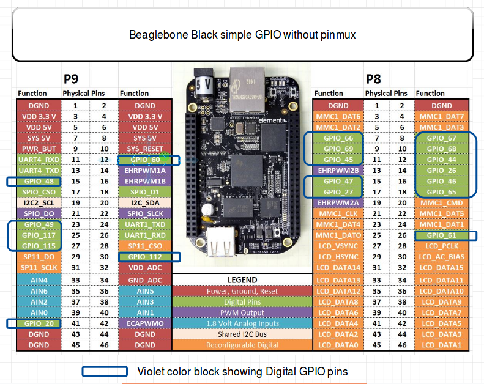
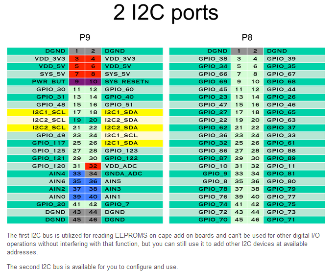
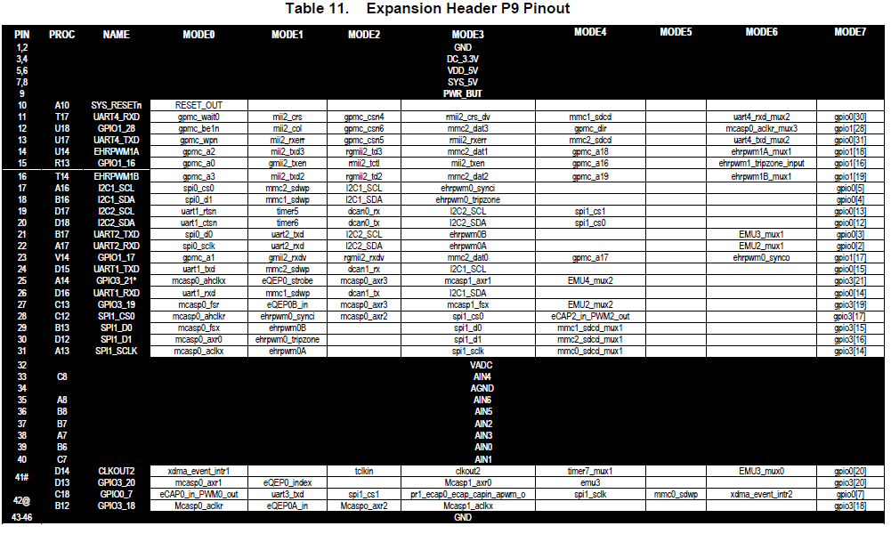
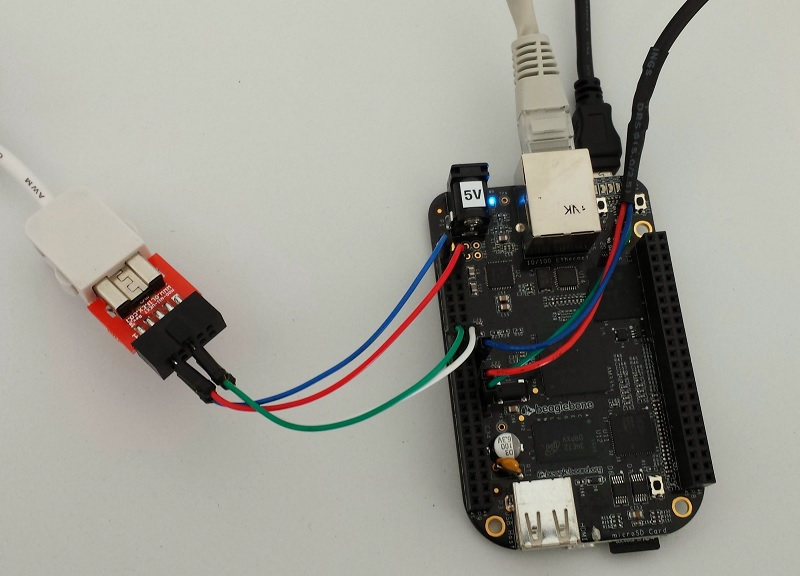

# Accessing Hardware Devices


## Objectives

* Learn how to access hardware devices.


## Setup

Go to the `$HOME/embedded-linux-bbb-labs/hardware/` directory, which provides useful files for
this lab.<br/>
However, we will go on booting the system through NFS, using the root filesystem built by the
previous lab.

```console
$ LAB_PATH="$HOME/embedded-linux-bbb-labs/hardware"
$ cd $LAB_PATH
```


## Exploring `/dev`

Start by exploring `/dev/` on your target system.

```console title="picocomBBB - BusyBox"
# ls /dev/
bus              ram10            tty26            tty58
console          ram11            tty27            tty59
cpu_dma_latency  ram12            tty28            tty6
full             ram13            tty29            tty60
gpiochip0        ram14            tty3             tty61
gpiochip1        ram15            tty30            tty62
gpiochip2        ram2             tty31            tty63
gpiochip3        ram3             tty32            tty7
hwrng            ram4             tty33            tty8
i2c-0            ram5             tty34            tty9
i2c-2            ram6             tty35            ttyS0
kmsg             ram7             tty36            ttyS1
loop-control     ram8             tty37            ttyS2
loop0            ram9             tty38            ttyS3
loop1            random           tty39            ttyS4
loop2            tty              tty4             ttyS5
loop3            tty0             tty40            ubi_ctrl
loop4            tty1             tty41            urandom
loop5            tty10            tty42            vcs
loop6            tty11            tty43            vcs1
loop7            tty12            tty44            vcs2
mem              tty13            tty45            vcs3
mmcblk0          tty14            tty46            vcs4
mmcblk0p1        tty15            tty47            vcsa
mmcblk1          tty16            tty48            vcsa1
mmcblk1boot0     tty17            tty49            vcsa2
mmcblk1boot1     tty18            tty5             vcsa3
mmcblk1p1        tty19            tty50            vcsa4
mmcblk1rpmb      tty2             tty51            vcsu
null             tty20            tty52            vcsu1
port             tty21            tty53            vcsu2
ptmx             tty22            tty54            vcsu3
ptp0             tty23            tty55            vcsu4
ram0             tty24            tty56            vga_arbiter
ram1             tty25            tty57            zero
```

Here are a few noteworthy device files that you will see:

* *Terminal devices*: devices starting with `tty`.<br/>
  Terminals are user interfaces taking text as input and producing text as output, and are typically used by interactive shells.<br/>
  In particular, you will find console which matches the device specified through `console=` in the kernel command line (*U-Boot*'s `bootargs`).<br/>
  You will also find the `ttyS0` device file we used for the emulated debug serial port.

* *Pseudo-terminal devices*: devices starting with `pty`, used when you connect through SSH for example.<br/>
  Those are virtual devices, but there are so many in `/dev/` that we wanted to give a description here.

* *MMC devices and partitions*: devices starting with `mmcblk`.<br/>
  You should here recognize the MMC devices on your system, and the associated partitions.

* If you have a real board (not *QEMU*) and a USB pen drive, you could plug it in, and if your
kernel was built with USB host and mass storage support, you should see a new `sda` device
appear, together with the <code>sda<b><i>X</i></b></code> devices for its partitions.

Don't hesitate to explore `/dev/` on your workstation too!

```console
$ ls /dev/
autofs           loop1         rtc0      tty2   tty47      ttyS15   vboxguest
block            loop10        sda       tty20  tty48      ttyS16   vboxuser
bsg              loop11        sda1      tty21  tty49      ttyS17   vcs
btrfs-control    loop12        sdb       tty22  tty5       ttyS18   vcs1
bus              loop13        sdb1      tty23  tty50      ttyS19   vcs2
cdrom            loop14        sdc       tty24  tty51      ttyS2    vcs3
char             loop2         sg0       tty25  tty52      ttyS20   vcs4
console          loop3         sg1       tty26  tty53      ttyS21   vcs5
core             loop4         sg2       tty27  tty54      ttyS22   vcs6
cpu              loop5         sg3       tty28  tty55      ttyS23   vcsa
cpu_dma_latency  loop6         shm       tty29  tty56      ttyS24   vcsa1
cuse             loop7         snapshot  tty3   tty57      ttyS25   vcsa2
disk             loop8         snd       tty30  tty58      ttyS26   vcsa3
dma_heap         loop9         sr0       tty31  tty59      ttyS27   vcsa4
dri              loop-control  stderr    tty32  tty6       ttyS28   vcsa5
ecryptfs         mapper        stdin     tty33  tty60      ttyS29   vcsa6
fb0              mcelog        stdout    tty34  tty61      ttyS3    vcsu
fd               mem           tty       tty35  tty62      ttyS30   vcsu1
full             mqueue        tty0      tty36  tty63      ttyS31   vcsu2
fuse             net           tty1      tty37  tty7       ttyS4    vcsu3
hidraw0          null          tty10     tty38  tty8       ttyS5    vcsu4
hpet             nvram         tty11     tty39  tty9       ttyS6    vcsu5
hugepages        port          tty12     tty4   ttyprintk  ttyS7    vcsu6
hwrng            ppp           tty13     tty40  ttyS0      ttyS8    vfio
i2c-0            psaux         tty14     tty41  ttyS1      ttyS9    vga_arbiter
initctl          ptmx          tty15     tty42  ttyS10     udmabuf  vhci
input            pts           tty16     tty43  ttyS11     uhid     vhost-net
kmsg             random        tty17     tty44  ttyS12     uinput   vhost-vsock
log              rfkill        tty18     tty45  ttyS13     urandom  zero
loop0            rtc           tty19     tty46  ttyS14     userio   zfs
```


## Exploring `/sys`

The next thing you can explore is the *sysfs* filesystem.

A good place to start is `/sys/class/`, which exposes devices classified by the kernel frameworks which manage them.

```console title="picocomBBB - BusyBox"
# ls /sys/class/
ata_device    extcon        mdio_bus      power_supply  scsi_host
ata_link      firmware      mem           pps           spi_master
ata_port      gpio          misc          ptp           thermal
backlight     graphics      mmc_host      pwm           tty
bdi           i2c-adapter   mtd           regulator     ubi
block         i2c-dev       net           remoteproc    udc
devcoredump   input         pci_bus       rtc           vc
devlink       iommu         pci_epc       scsi_device   vtconsole
dma           lcd           phy           scsi_disk     wakeup
```

For example, go to `/sys/class/net/`, and you will see all the networking interfaces on your system, whether they are internal, external or virtual ones.

```console title="picocomBBB - BusyBox"
# ls /sys/class/net/
eth0  lo    sit0  usb0
```

Find which subdirectory corresponds to the network connection to your host system, and then check device properties such as:

* `speed`: will show you whether this is a gigabit or hundred megabit interface.

* `address`: will show the device MAC address. No need to get it from a complex command!

* `statistics/rx_bytes` will show you how many bytes were received on this interface.

Don't hesitate to look for further interesting properties by yourself!

```console title="picocomBBB - BusyBox"
# ls /sys/class/net/eth0/
addr_assign_type      flags                 phys_port_name
addr_len              gro_flush_timeout     phys_switch_id
address               ifalias               power
broadcast             ifindex               proto_down
carrier               iflink                queues
carrier_changes       link_mode             speed
carrier_down_count    mtu                   statistics
carrier_up_count      name_assign_type      subsystem
dev_id                napi_defer_hard_irqs  testing
dev_port              netdev_group          threaded
device                operstate             tx_queue_len
dormant               phydev                type
duplex                phys_port_id          uevent
# cat /sys/class/net/eth0/speed
100
# cat /sys/class/net/eth0/address
54:4a:16:be:9e:ae
# cat /sys/class/net/eth0/statistics/rx_bytes
925186
```

You can also check whether `/sys/class/thermal/` exists and is not empty on your system.
That's the thermal framework, and it allows to access temperature measures from the thermal sensors on your system.

```console title="picocomBBB - BusyBox"
# ls /sys/class/thermal/
```

Next, you can now explore all the buses (virtual or physical) available on your system, by checking the contents of `/sys/bus/`.
In particular, go to `/sys/bus/mmc/devices/` to see all the MMC devices on your system.<br/>
Go inside the directory for the first device and check several files (for example):

* `serial`: the serial number for your device.

* `preferred_erase_size`: the preferred erase block for your device. It's recommended that partitions start at multiples of this size.

* `name`: the product name for your device. You could display it in a user interface or log file, for example.

```console title="picocomBBB - BusyBox"
# ls /sys/bus/
clockevents   genpd         mipi-dsi      pci-epf       soc
clocksource   gpio          mmc           platform      spi
container     hid           mmc_rpmb      scsi          usb
cpu           i2c           nvmem         sdio          virtio
event_source  mdio_bus      pci           serial        workqueue
# ls /sys/bus/mmc/devices/
mmc0:0001  mmc1:0001
# ls /sys/bus/mmc/devices/mmc0:0001/
block                 hwrev                 scr
cid                   manfid                serial
csd                   name                  ssr
date                  ocr                   subsystem
driver                oemid                 type
dsr                   power                 uevent
erase_size            preferred_erase_size
fwrev                 rca
# cat /sys/bus/mmc/devices/mmc0:0001/serial
0x000015f1
# cat /sys/bus/mmc/devices/mmc0:0001/preferred_erase_size
4194304
# cat /sys/bus/mmc/devices/mmc0:0001/name
SD16G
```

Don't hesitate to spend more time exploring `/sys/` on your system!


## Driving GPIOs

At this stage, we can only explore GPIOs through the legacy interface in `/sys/class/gpio/`, because the `libgpiod` interface commands are provided through a dedicated project which we have to build separately, and *BusyBox* does not provide a re-implementation for the `libgpiod` tools.
In a later lab, we will build `libgpiod` tools which use the modern `/dev/gpiochipX` interface.

The first thing to do is to enable this legacy interface by enabling `CONFIG_GPIO_SYSFS` in the kernel configuration.
Also make sure *debugfs* is enabled (`CONFIG_DEBUG_FS` and `CONFIG_DEBUG_FS_ALLOW_ALL`).

After rebooting the new kernel, the first thing to do is to mount the *debugfs* filesystem.<br/>
Then, you can check information about available GPIOs banks and which GPIOs are already in use.

```console title="picocomBBB - BusyBox" hl_lines="3 10 17 23"
# mount -t debugfs debugfs /sys/kernel/debug/
# cat /sys/kernel/debug/gpio
gpiochip0: GPIOs 0-31, parent: platform/4804c000.gpio, gpio-0-31:
 gpio-0   (P8_25 [mmc1_dat0]   )
 gpio-1   ([mmc1_dat1]         )
    ...
 gpio-30  (P8_21 [emmc]        )
 gpio-31  (P8_20 [emmc]        )

gpiochip1: GPIOs 32-63, parent: platform/481ac000.gpio, gpio-32-63:
 gpio-32  (P9_15B              )
 gpio-33  (P8_18               )
    ...
 gpio-62  ([mmc0_clk]          )
 gpio-63  ([mmc0_cmd]          )

gpiochip2: GPIOs 64-95, parent: platform/481ae000.gpio, gpio-64-95:
 gpio-64  ([mii col]           )
 gpio-65  ([mii crs]           )
    ...
 gpio-94  (NC                  )
 gpio-95  (NC                  )
gpiochip3: GPIOs 96-127, parent: platform/44e07000.gpio, gpio-96-127:
 gpio-96  ([mdio_data]         )
 gpio-97  ([mdio_clk]          )
    ...
 gpio-126 (P9_11 [uart4_rxd]   )
 gpio-127 (P9_13 [uart4_txd]   )

```

We are going to use one of the free GPIOs on the expansion headers of the board, which is not already used by another device.



Take one of the M-M breadboard wires and:

* Connect one end to pin 12 of connector *P9*.
* Connect the other end to pin 1 (`DGND`) of connector *P9*.

If you check the description of the *P9* connector on the board
[*System Reference Manual*](BBB_SRM.pdf),
you can see that pin 12 is now called `GPIO1_28` instead of `GPIO_60` in the above diagram.
This pin is already configured as a GPIO by default &mdash; no need to change pin muxing to use this pin as a GPIO.

If you get back to the contents of `/sys/kernel/debug/gpio/`, you'll recognize the association between `gpio-28` on GPIO pin bank `0` (`gpiochip0`) and header pin `P9_12`.
That's very useful information, but you don't have this level of details for all boards, unfortunately.

We now have everything we need to drive this GPIO using the *legacy* interface.
First, let's enable it.

```console title="picocomBBB - BusyBox" hl_lines="12"
# cd /sys/class/gpio/
# ls -1
export
gpiochip0
gpiochip32
gpiochip64
gpiochip96
unexport
# echo 28 > export
# ls -1
export
gpio28
gpiochip0
gpiochip32
gpiochip64
gpiochip96
unexport
```

If indeed the pin is still available, this should create a new `gpio28` file should appear in `/sys/class/gpio/`.

We can now configure this pin as input, and check its `value`.
You could use this GPIO to add a button switch to your board, for example.
The value should be `0` as the pin is connected to a ground level.

```console title="picocomBBB - BusyBox"
# echo in > gpio28/direction
# cat gpio28/value
0
```

Now, let's connect our GPIO pin to pin 3 (VDD 3.3 V) of connector P9. Check the above diagram if needed.
Let's check the `value` again. The value is `1` because our pin is connected to a 3.3 V level now.

```console title="picocomBBB - BusyBox"
# cat gpio28/value
1
```

Note that you could also configure the pin as output and set its value through the `value` file.
This way, you could add an external LED to your board, for example.

Before moving on to the next section, you can also check `/sys/kernel/debug/gpio/` again, and see that `gpio-28` is now in use, through the *sysfs* interface, and is configured as an input pin.

When you're done, you can see your GPIO free.

```console title="picocomBBB - BusyBox"
# echo 28 > unexport
```


## Driving LEDs

First, make sure your *kernel* is compiled with:

* `LEDS_CLASS=y`
* `LEDS_GPIO=y`
* `LEDS_TRIGGER_TIMER=y`

```console
$ cd "$LAB_PATH/../kernel/linux/"
$ cp "$LAB_PATH/../tinysystem/kernel-busybox.config" .config
$ make menuconfig
$ cp .config "$LAB_PATH/kernel-leds.config"
$ TC_NAME="arm-training-linux-uclibcgnueabihf"
$ TC_BASE="$HOME/x-tools/$TC_NAME"
$ export PATH="$TC_BASE/bin:$PATH"
$ export CROSS_COMPILE=arm-linux-
$ export MAKEFLAGS=-j$(nproc)
$ export ARCH=arm
$ make
$ cp arch/arm/boot/zImage /srv/tftp/zImage-with-LEDs
$ cp arch/arm/boot/zImage /srv/tftp/zImage
```

Then, go to `/sys/class/leds/` to see all the LEDs that you are allowed to control.

```console title="picocomBBB - BusyBox" hl_lines="3"
# cd /sys/class/leds/
# ls -1
beaglebone:green:heartbeat
beaglebone:green:mmc0
beaglebone:green:usr2
beaglebone:green:usr3
mmc0::
mmc1::
```

Let's control the LED called `beaglebone:green:heartbeat`.<br/>
Go into the directory for this LED, and check its `trigger` (what routine is used to drive its value),

```console title="picocomBBB - BusyBox" hl_lines="4"
# cd beaglebone:green:heartbeat/
# triggers=$(cat trigger)
# for t in $triggers; do echo $t; done
[none]
kbd-scrolllock
kbd-numlock
kbd-capslock
kbd-kanalock
kbd-shiftlock
kbd-altgrlock
kbd-ctrllock
kbd-altlock
kbd-shiftllock
kbd-shiftrlock
kbd-ctrlllock
kbd-ctrlrlock
timer
cpu
cpu0
mmc0
mmc1
```

As you can see, there are many triggers to choose from, the current being `none`.

You can directly control the LED without a trigger:

```console title="picocomBBB - BusyBox"
# echo none > trigger
# echo 1 > brightness
# echo 0 > brightness
```

You could also use the timer trigger to light the LED with specified time on and time off.

```console title="picocomBBB - BusyBox"
# echo timer > trigger
# echo 10 > delay_on
# echo 200 > delay_off
```

You can disable all triggers by:

```console title="picocomBBB - BusyBox"
# echo none > trigger
```


## Managing I2C bus and devices


### Enabling I2C bus

The next thing we want to do is connect a *Nintendo Nunchuk* joystick to an *I2C* bus on our board.
The I2C bus is very frequently used to connect all sorts of external devices. That's why we're covering it here.

As shown on the picture below, the BeagleBone Black has two I2C busses available on its expansion headers: *I2C1* and *I2C2*. Another one exists (*I2C0*), but it's not available on the external headers.



In this lab, we will try to use *I2C1* on *P9* pins 17 and 18, because it's more interesting to use than *I2C2*, which is already enabled by default.

So, let's see which I2C buses are already enabled:

```console title="picocomBBB - BusyBox"
# i2cdetect -l
i2c-2   i2c             OMAP I2C adapter                        I2C adapter
i2c-0   i2c             OMAP I2C adapter                        I2C adapter
```

Here you can see that I2C1 is missing.

As the bus numbering scheme in Linux doesn't always match the one on the datasheets, let's check the base addresses of the registers of these controllers:

```console title="picocomBBB - BusyBox"
# ls -l /sys/bus/i2c/devices/i2c-*
lrwxrwxrwx    1         0 Jan  1 01:15 /sys/bus/i2c/devices/i2c-0 -> \
../../../devices/platform/ocp/44c00000.interconnect/\
44c00000.interconnect:segment@200000/44e0b000.target-module/44e0b000.i2c/i2c-0
lrwxrwxrwx    1         0 Jan  1 01:15 /sys/bus/i2c/devices/i2c-2 -> \
../../../devices/platform/ocp/48000000.interconnect/\
48000000.interconnect:segment@100000/4819c000.target-module/4819c000.i2c/i2c-2
```

That's not completely straighforward, but you can suppose that:

* *I2C0* is at address `0x44e0b000`
* *I2C2* is at address `0x4819c000`

Now let's double check the addressings by looking at the *TI AM335x* SoC datasheet, in the *L4_WKUP Peripheral Memory Map* section:

* *I2C0* is at address `0x44e0b000`
* *I2C1* is at address `0x4802a000`
* *I2C2* is at address `0x4819c000`

So, we are lucky that `i2c-0` in Linux corresponds to *I2C0* in the datasheet, and that `i2c-2` corresponds to *I2C2*. We're just missing `i2c-1`.


### Customizing Device Tree

Fortunately, *I2C1* is already defined in the one of the *DTS* includes used by the *Device Tree* for our board. In our case, that's in `arch/arm/boot/dts/am33xx-l4.dtsi`.
Look by yourself in this file, and you will find its definition, but with `status = "disabled";`.
This means that this I2C controller is not enabled yet, and it's up to boards using it to do so.

We could modify the `arch/arm/boot/dts/am335x-boneblack.dts` file for our board, but that's not a very good idea as this file is maintained by the kernel developers.
The changes that you make could collide with future changes made by the maintainers for this file.

A more futureproof idea is to create a new Device Tree file which includes the standard one, and adds custom definitions. So, create a new `arch/arm/boot/dts/am335x-boneblack-custom.dts` file containing:

```c title="arch/arm/boot/dts/am335x-boneblack-custom.dts"
/dts-v1/;
#include "am335x-boneblack.dts"

&i2c1 {
        status = "okay";
};
```

As you can see, it's also possible to include `dts` files, and not only `dtsi` ones.

Modify the `arch/arm/boot/dts/Makefile` file to add your custom Device Tree, and then have it compiled (`make dtbs`).

```make title="arch/arm/boot/dts/Makefile" hl_lines="9"
    ...
dtb-$(CONFIG_SOC_AM33XX) += \
        am335x-baltos-ir2110.dtb \
        am335x-baltos-ir3220.dtb \
        am335x-baltos-ir5221.dtb \
        am335x-base0033.dtb \
        am335x-bone.dtb \
        am335x-boneblack.dtb \
        am335x-boneblack-custom.dtb \
        am335x-boneblack-wireless.dtb \
        am335x-boneblue.dtb \
        am335x-bonegreen.dtb \
    ...
```

Reboot your board with the update.

```console hl_lines="2"
$ make
  DTC     arch/arm/boot/dts/am335x-boneblack-custom.dtb
    ...
$ cp arch/arm/boot/dts/am335x-boneblack-custom.dtb /srv/tftp/
```

```console title="picocomBBB - U-Boot"
    ...
Hit any key to stop autoboot:  0
=> setenv bootcmd "tftp 0x81000000 zImage;  tftp 0x82000000 am335x-boneblack-custom.dtb;  bootz 0x81000000 - 0x82000000"
=> saveenv
=> reset
```

Back to the running system, we can now see that there is one more I2C bus:

```console title="picocomBBB - BusyBox"
# i2cdetect -l
i2c-1   i2c             OMAP I2C adapter                        I2C adapter
i2c-2   i2c             OMAP I2C adapter                        I2C adapter
i2c-0   i2c             OMAP I2C adapter                        I2C adapter
```

Run the below command to confirm that the new bus has the same address as in the datasheet (`0x4802a000`):

```console title="picocomBBB - BusyBox"
# ls -l /sys/bus/i2c/devices/i2c-1
lrwxrwxrwx    1         0 Jan  1 00:02 /sys/bus/i2c/devices/i2c-1 -> \
  ../../../devices/platform/ocp/48000000.interconnect/\
  48000000.interconnect:segment@0/4802a000.target-module/4802a000.i2c/i2c-1
```

Now, let's use `i2cdetect`'s capability to probe a bus for devices.
Let's start by the bus associated to `i2c-0`:

```console title="picocomBBB - BusyBox"
# i2cdetect -r 0
i2cdetect: WARNING! This program can confuse your I2C bus
Continue? [y/N] y
     0  1  2  3  4  5  6  7  8  9  a  b  c  d  e  f
00:          -- -- -- -- -- -- -- -- -- -- -- -- --
10: -- -- -- -- -- -- -- -- -- -- -- -- -- -- -- --
20: -- -- -- -- UU -- -- -- -- -- -- -- -- -- -- --
30: -- -- -- -- 34 -- -- -- -- -- -- -- -- -- -- --
40: -- -- -- -- -- -- -- -- -- -- -- -- -- -- -- --
50: 50 -- -- -- -- -- -- -- -- -- -- -- -- -- -- --
60: -- -- -- -- -- -- -- -- -- -- -- -- -- -- -- --
70: -- -- -- -- -- -- -- --
```

We can see three devices on this internal bus:

* One at address `0x24`, indicated by `UU`, which means that there is a kernel driver actively driving this device.

* Two other devices at addresses `0x34` and `0x50`. We just know that they are currently not bound to a kernel driver.

Now try to probe *I2C1*:

```console title="picocomBBB - BusyBox" hl_lines="5"
# i2cdetect -r 1
i2cdetect: WARNING! This program can confuse your I2C bus
Continue? [y/N] y
     0  1  2  3  4  5  6  7  8  9  a  b  c  d  e  f
00:          [  469.430509] omap_i2c 4802a000.i2c: timeout waiting for bus ready
    ...
```

You will see that the command will fail to connect to the bus. That's because the corresponding
signals are not exposed yet to the outside connectors through pin muxing.

So, get back to your custom Device Tree and add pin muxing definitions for *I2C1* (we took them from a device tree from another board with the same CPU: `arch/arm/boot/dts/am335x-evm.dts`) and refer to these definitions in the `i2c1` node through the `pinctrl-names` and `pinctrl-0` properties:

```c title="arch/arm/boot/dts/am335x-boneblack-custom.dts"
/dts-v1/;
#include "am335x-boneblack.dts"

&am33xx_pinmux {
        i2c1_pins: pinmux_i2c1_pins {
                pinctrl-single,pins = <
                        AM33XX_PADCONF(AM335X_PIN_SPI0_CS0, PIN_INPUT_PULLUP, MUX_MODE2)  /* spi0_cs0.i2c1_scl */
                        AM33XX_PADCONF(AM335X_PIN_SPI0_D1, PIN_INPUT_PULLUP, MUX_MODE2)  /* spi0_d1.i2c1_sda */
                >;
        };
};

&i2c1 {
        pinctrl-names = "default";
        pinctrl-0 = <&i2c1_pins>;
        status = "okay";
};
```

You can understand the above values thanks to the pin muxing diagram for connector *P9*, which was extracted from the board [*System Reference Manual*](BBB_SRM.pdf):

* `AM335X_PIN_SPI0_CS0` and `AM335X_PIN_SPI0_D1` are the offsets of the registers controlling pin muxing for the corresponding pins of the SoC package.

* `PIN_INPUT_PULLUP` is one of the supported options for these pins. They integrate the pull-up resistors expected for an *I2C* bus (typically by external resistors).

* `MUX_MODE2` corresponds to *MODE2*, to get *I2C1_SCL* and *I2C1_SDA* signals on such pins.



Recompile your Device Tree and reboot.

```console hl_lines="2"
$ make
  DTC     arch/arm/boot/dts/am335x-boneblack-custom.dtb
    ...
$ cp arch/arm/boot/dts/am335x-boneblack-custom.dtb /srv/tftp/
```

You should now be able to probe your bus:

```console title="picocomBBB - BusyBox"
# i2cdetect -r 1
i2cdetect: WARNING! This program can confuse your I2C bus
Continue? [y/N] y
     0  1  2  3  4  5  6  7  8  9  a  b  c  d  e  f
00:          -- -- -- -- -- -- -- -- -- -- -- -- --
10: -- -- -- -- -- -- -- -- -- -- -- -- -- -- -- --
20: -- -- -- -- -- -- -- -- -- -- -- -- -- -- -- --
30: -- -- -- -- -- -- -- -- -- -- -- -- -- -- -- --
40: -- -- -- -- -- -- -- -- -- -- -- -- -- -- -- --
50: -- -- -- -- -- -- -- -- -- -- -- -- -- -- -- --
60: -- -- -- -- -- -- -- -- -- -- -- -- -- -- -- --
70: -- -- -- -- -- -- -- --
```

No device is detected yet, because this bus is just used for external devices. It's time to add one though.


### Adding I2C device

Let's connect the *Nunchuk* to the *I2C1* bus on the board. To know its pinout, please refer to the [excerpt found on the *Bootlin* website](nunchuk.pdf).<br/>
Connections on the *Nunchuk* depend on the adapter you're using (if any); please refer to its own pinout.



If you didn't make any mistakes, your new device should be detected at address `0x52`:

```console title="picocomBBB - BusyBox"
# i2cdetect -r 1
i2cdetect: WARNING! This program can confuse your I2C bus
Continue? [y/N] y
     0  1  2  3  4  5  6  7  8  9  a  b  c  d  e  f
00:          -- -- -- -- -- -- -- -- -- -- -- -- --
10: -- -- -- -- -- -- -- -- -- -- -- -- -- -- -- --
20: -- -- -- -- -- -- -- -- -- -- -- -- -- -- -- --
30: -- -- -- -- -- -- -- -- -- -- -- -- -- -- -- --
40: -- -- -- -- -- -- -- -- -- -- -- -- -- -- -- --
50: -- -- 52 -- -- -- -- -- -- -- -- -- -- -- -- --
60: -- -- -- -- -- -- -- -- -- -- -- -- -- -- -- --
70: -- -- -- -- -- -- -- --
```

Later we're going to compile an out-of-tree kernel module to support this device.


## Plugging an audio USB headset

In the next labs, we are going to play audio using a USB audio headset. Let's see whether our kernel supports such hardware by plugging the USB headset.

Before plugging the device, look at the output of `lsusb`:

```console title="picocomBBB - BusyBox"
# lsusb
Bus 001 Device 001: ID 1d6b:0002
```

Now, when you plug the USB headset, a number of messages should appear on the console, and running `lsusb` again should show an additional device:

```console title="picocomBBB - BusyBox"
# lsusb
Bus 001 Device 001: ID 1d6b:0002
Bus 001 Device 004: ID 1b3f:2008
```

The device of vendor ID `1b3f` and product ID `2008` has appeared.
Of course, this depends on the actual USB audio device that you used.

The device also appears in `/sys/bus/usb/devices/`, in a directory whose name depends on the topology of the USB bus.
When the device is plugged in the kernel messages show:

```console title="picocomBBB - BusyBox"
# dmesg
    ...
usb 1-1: new full-speed USB device number 4 using musb-hdrc
usb 1-1: New USB device found, idVendor=1b3f, idProduct=2008, bcdDevice= 1.00
usb 1-1: New USB device strings: Mfr=1, Product=2, SerialNumber=0
usb 1-1: Product: USB Audio Device
usb 1-1: Manufacturer: GeneralPlus
    ...
```

So if we go in `/sys/bus/usb/devices/1-1/`, we get the sysfs representation of this USB device:

```console title="picocomBBB - BusyBox"
# cd /sys/bus/usb/devices/1-1/
# cat idVendor
1b3f
# cat idProduct
2008
# cat busnum
1
# cat devnum
4
# cat product
USB Audio Device
```

However, while the USB device is detected, we currently do not have any driver for this device, so no actual sound card is detected.


## In-tree kernel modules

Go back to the kernel source directory.

The Linux kernel has a generic driver supporting all USB audio devices supporting the standard *USB audio class*.
This driver can be enabled using the `SND_USB_AUDIO` configuration option.
Look for this parameter in the kernel configuration, and you should find that it is already enabled as a *module*.

So, instead of compiling the corresponding driver as a *built-in*, that's a good opportunity to practice with *kernel modules*.<br/>
So, compile your modules:

```console
$ cd "$LAB_PATH/../kernel/linux/"
$ make modules
```

Then, following details given in the lectures, install the modules in our *NFS root filesystem*
(`$HOME/embedded-linux-bbb-labs/tinysystem/nfsroot/`).<br/>
Also make sure to update the kernel image (`make zImage`), and reboot the board.

```console
$ export INSTALL_MOD_PATH="$LAB_PATH/../tinysystem/nfsroot"
$ make modules_install
    ...
  INSTALL /home/me/embedded-linux-bbb-labs/hardware/../tinysystem/nfsroot/lib/modules/5.15.104/kernel/sound/usb/snd-usbmidi-lib.ko
  DEPMOD  /home/me/embedded-linux-bbb-labs/hardware/../tinysystem/nfsroot/lib/modules/5.15.104
$ cp arch/arm/boot/zImage /srv/tftp/zImage
```

> If using *git* for the Linux kernel source tree, due to the changes we have made to the kernel source code, the kernel version is now `5.15.<x>-dirty`, the `dirty` keyword indicating that the *git* working tree has uncommitted changes.<br/>
> The modules are therefore installed in `/lib/modules/5.15.<x>-dirty/`, and the version of the running Linux kernel must match this.

After rebooting, try to load the module that we need (`snd-usb-audio`).<br/>
By running `lsmod`, see all the module dependencies that were loaded too..<br/>
You can also see that a new USB device driver in `/sys/bus/usb/drivers/snd-usb-audio`. This directory shows which USB devices are bound to this driver.

```console hl_lines="5 8"
# uname -r
5.15.104-dirty
# modprobe snd-usb-audio
mc: Linux media interface: v0.10
usbcore: registered new interface driver snd-usb-audio
# lsmod
Module                  Size  Used by
snd_usb_audio         217088  0
snd_hwdep              16384  1 snd_usb_audio
snd_usbmidi_lib        28672  1 snd_usb_audio
mc                     36864  1 snd_usb_audio
snd_rawmidi            28672  1 snd_usbmidi_lib
snd_pcm               106496  1 snd_usb_audio
snd_timer              28672  1 snd_pcm
snd                    61440  6 snd_usb_audio,snd_hwdep,snd_usbmidi_lib,snd_rawmidi,snd_pcm,snd_timer
soundcore              16384  1 snd
```

You can check that `/proc/asound/` now exists (thanks to loading modules for *ALSA*, the Linux sound subsystem), and that one sound card is available:

```console
# ls /proc/asound/
cards    devices  hwdep    modules  oss      pcm      timers   version
# cat /proc/asound/cards
**TODO**
--- no soundcards ---
```

Check also the `/dev/snd/` directory, which should now contain some character device files.
These will be used by the user-space libraries and applications to access the audio devices.

```console
# ls /dev/snd/
**TODO**
timer
```

Modify your startup scripts so that the `snd-usb-audio` module is always loaded at startup.

```console hl_lines="7"
# cat > /etc/init.d/rcS <<'EOF'
#!/bin/sh
mount -t proc proc /proc
mount -t sysfs sys /sys
mount -t devtmpfs dev /dev
/usr/sbin/httpd -h /www/
modprobe snd-usb-audio
EOF
```

We cannot test the sound card yet, as we will need to build some software first. Be patient, this is coming soon!


## Out-of-tree kernel modules

The next device we want to support is the I2C *Nintendo Nunchuk*.
There is a driver in the kernel to support it when connected to a *Wiimote* controller, but there is no such driver to support it as an I2C device.

Fortunately, one is provided in `$HOME/embedded-linux-bbb-labs/hardware/data/nunchuk/nunchuk.c`.
You can check [*Bootlin*'s Linux kernel and driver development course](https://bootlin.com/training/kernel/) to learn how to implement all sorts of device drivers for Linux.

Go to this directory, and compile the out-of-tree module as follows:

```console
$ cd "$LAB_PATH/data/nunchuk/"
$ make -C "$LAB_PATH/../kernel/linux" M=$PWD
make: Entering directory '/home/me/embedded-linux-bbb-labs/kernel/linux'
  CC [M]  /home/me/embedded-linux-bbb-labs/hardware/data/nunchuk/nunchuk.o
  MODPOST /home/me/embedded-linux-bbb-labs/hardware/data/nunchuk/Module.symvers
  CC [M]  /home/me/embedded-linux-bbb-labs/hardware/data/nunchuk/nunchuk.mod.o
  LD [M]  /home/me/embedded-linux-bbb-labs/hardware/data/nunchuk/nunchuk.ko
make: Leaving directory '/home/me/embedded-linux-bbb-labs/kernel/linux'
```

Here are a few explanations:

* The `-C` option lets make know which `Makefile` to use, here the toplevel `Makefile` in the kernel sources.

* `M=$PWD` tells the kernel `Makefile` to build external modules from the files in the current directory.

Now, you can install the compiled module in the NFS *root* filesystem by passing the `modules_install` target and specifying the target directory through the `INSTALL_MOD_PATH` variable.

```console
$ make -C "$LAB_PATH/../kernel/linux" M=$PWD modules_install
make: Entering directory '/home/me/embedded-linux-bbb-labs/kernel/linux'
  INSTALL /home/me/embedded-linux-bbb-labs/hardware/../tinysystem/nfsroot/lib/modules/5.15.104/extra/nunchuk.ko
  DEPMOD  /home/me/embedded-linux-bbb-labs/hardware/../tinysystem/nfsroot/lib/modules/5.15.104
make: Leaving directory '/home/me/embedded-linux-bbb-labs/kernel/linux'
```

You can see that this installs out-of-tree kernel modules under `lib/modules/<version>/extra/`.

Back on the target, you can now check that your custom module can be loaded:

```console title="picocomBBB - BusyBox"
# modprobe nunchuk
[ 4317.737978] nunchuk: loading out-of-tree module taints kernel.
```

See `kbuild/modules` in kernel documentation for details about building out-of-tree kernel modules.

However, run `i2cdetect -r 1` again. You will see that the *Nunchuk* is still detected, but still not driven by the kernel. Otherwise, it would be signaled by the `UU` placeholder.

```console title="picocomBBB - BusyBox"
# i2cdetect -r 1
i2cdetect: WARNING! This program can confuse your I2C bus
Continue? [y/N] y
     0  1  2  3  4  5  6  7  8  9  a  b  c  d  e  f
00:          -- -- -- -- -- -- -- -- -- -- -- -- --
10: -- -- -- -- -- -- -- -- -- -- -- -- -- -- -- --
20: -- -- -- -- -- -- -- -- -- -- -- -- -- -- -- --
30: -- -- -- -- -- -- -- -- -- -- -- -- -- -- -- --
40: -- -- -- -- -- -- -- -- -- -- -- -- -- -- -- --
50: -- -- 52 -- -- -- -- -- -- -- -- -- -- -- -- --
60: -- -- -- -- -- -- -- -- -- -- -- -- -- -- -- --
70: -- -- -- -- -- -- -- --
```

You may also look at the `nunchuk.c` file and notice a *Nunchuk* device probed successfully message that you didn't see when loading the module.

That's because the Linux kernel doesn't know about the *Nunchuk* device yet, even though the driver for this kind of devices is already loaded. Our device also has to be described in the *Device Tree*.

You can confirm this by having a look at the contents of the `/sys/bus/i2c/` directory.
It contains two subdirectories: `devices` and `drivers`.<br/>
In `drivers`, there should be a `nunchuk` subdirectory, but no *symbolic link* to a device yet.<br/>
In `devices` you should see some devices, but not the *Nunchuk* one yet.

```console title="picocomBBB - BusyBox" hl_lines="2 3 13"
# ls -1 /sys/bus/i2c/
devices
drivers
drivers_autoprobe
drivers_probe
uevent
# ls -1 /sys/bus/i2c/drivers/
dummy
lp872x
lp873x
lp87565
menelaus
nunchuk
palmas
pcf857x
tps65023
tps65217
tps65218
tps65910
twl
twl6040
# ls -1 /sys/bus/i2c/devices/
0-0024
0-0050
0-0070
2-0054
2-0055
2-0056
2-0057
i2c-0
i2c-1
i2c-2
```


## Declaring I2C device

To allow the kernel to manage our *Nunchuk* device, let's declare the device in the custom *Device Tree* for our board. The declaration of the *I2C1* bus will then look as follows:

```c title="arch/arm/boot/dts/am335x-boneblack-custom.dts - modified i2c1"
&i2c1 {
        status = "okay";
        clock-frequency = <100000>;

        nunchuk: joystick@52 {
                compatible = "nintendo,nunchuk";
                reg = <0x52>;
        };
};
```

Here are a few notes:

* The `clock-frequency` property is used to configure the bus to operate at 100 KHz. This is supposed to be required for the *Nunchuk*.

* The *Nunchuk* device is added through a child node in the I2C controller node.

* For the kernel to probe and drive our device, it's required that the `compatible` string matches one of the compatible strings supported by the driver.

* The `reg` property is the address of the device on the I2C bus. If it doesn't match, the driver will probe the device but won't be able to communicate with it.

Recompile your *Device Tree* and reboot your kernel with the new binary.

```console
$ cd "$LAB_PATH/../kernel/linux/"
$ nano arch/arm/boot/dts/am335x-boneblack-custom.dts
$ make
    ...
  DTC     arch/arm/boot/dts/am335x-boneblack-custom.dtb
    ...
$ cp arch/arm/boot/dts/am335x-boneblack-custom.dtb /srv/tftp/
```

You can now load your module again, and this time, you should see that the `nunchuk` driver probed the *Nunchuk* device: **TBV**

```console title="picocomBBB - BusyBox" hl_lines="2 3 13"
# modprobe nunchuk
[ 66.680455] nunchuk: loading out-of-tree module taints kernel.
[ 66.687645] input: Wii Nunchuk as /devices/platform/ocp/48000000.interconnect/\
48000000.interconnect:segment@0/4802a000.target-module/4802a000.i2c/\
i2c-1/1-0052/input/input0
[ 66.695421] Nunchuk device probed successfully
```

List the contents of `/sys/bus/i2c/drivers/nunchuk` once again. You should now see a *symbolic link* corresponding to our new device.

```console title="picocomBBB - BusyBox" hl_lines="3"
# ls -l /sys/bus/i2c/drivers/nunchuk/
--w-------    1      4096 Jan  1 00:17 bind
lrwxrwxrwx    1         0 Jan  1 00:17 module -> ../../../../module/nunchuk
--w-------    1      4096 Jan  1 00:17 uevent
--w-------    1      4096 Jan  1 00:17 unbind
```

Also list `/sys/bus/i2c/devices/` again. You should now see the *Nunchuk* device, which can be recognized through its `0052` address.
Follow the *symbolic link* and you should see a *symbolic link* back to the *Nunchuk* driver!

```console title="picocomBBB - BusyBox" hl_lines="5"
# ls -l /sys/bus/i2c/devices/
**FIXME**
lrwxrwxrwx    1         0 Jan  1 00:03 0-0024 -> ../../../devices/platform/ocp/44c00000.interconnect/44c00000.interconnect:segment@200000/44e0b000.target-module/44e0b000.i2c/i2c-0/0-0024
lrwxrwxrwx    1         0 Jan  1 00:03 0-0050 -> ../../../devices/platform/ocp/44c00000.interconnect/44c00000.interconnect:segment@200000/44e0b000.target-module/44e0b000.i2c/i2c-0/0-0050
lrwxrwxrwx    1         0 Jan  1 00:03 0-0070 -> ../../../devices/platform/ocp/44c00000.interconnect/44c00000.interconnect:segment@200000/44e0b000.target-module/44e0b000.i2c/i2c-0/0-0070
lrwxrwxrwx    1         0 Jan  1 00:03 2-0054 -> ../../../devices/platform/ocp/48000000.interconnect/48000000.interconnect:segment@100000/4819c000.target-module/4819c000.i2c/i2c-2/2-0054
lrwxrwxrwx    1         0 Jan  1 00:03 2-0055 -> ../../../devices/platform/ocp/48000000.interconnect/48000000.interconnect:segment@100000/4819c000.target-module/4819c000.i2c/i2c-2/2-0055
lrwxrwxrwx    1         0 Jan  1 00:03 2-0056 -> ../../../devices/platform/ocp/48000000.interconnect/48000000.interconnect:segment@100000/4819c000.target-module/4819c000.i2c/i2c-2/2-0056
lrwxrwxrwx    1         0 Jan  1 00:03 2-0057 -> ../../../devices/platform/ocp/48000000.interconnect/48000000.interconnect:segment@100000/4819c000.target-module/4819c000.i2c/i2c-2/2-0057
lrwxrwxrwx    1         0 Jan  1 00:03 i2c-0 -> ../../../devices/platform/ocp/44c00000.interconnect/44c00000.interconnect:segment@200000/44e0b000.target-module/44e0b000.i2c/i2c-0
lrwxrwxrwx    1         0 Jan  1 00:03 i2c-1 -> ../../../devices/platform/ocp/48000000.interconnect/48000000.interconnect:segment@0/4802a000.target-module/4802a000.i2c/i2c-1
lrwxrwxrwx    1         0 Jan  1 00:03 i2c-2 -> ../../../devices/platform/ocp/48000000.interconnect/48000000.interconnect:segment@100000/4819c000.target-module/4819c000.i2c/i2c-2
```

We are not ready to use this input device yet, but at least we can test that we get bytes when buttons or the joypad are used.
In the below command, use the same number as in the message you got in the console (`event0` for `input0` for example):

```console title="picocomBBB - BusyBox"
# od -x /dev/input/event0
**TODO**
```

We will use the *Nunchuk* to control audio playback in an upcoming lab.


## Setting board model name

Modify the custom *Device Tree* file one last time to override the model name for your system.
Set the `model` property to `BeagleBone Black media player`.

```console hl_lines="3 8 15-17"
$ cd "$LAB_PATH/../kernel/linux/"
$ grep "model" arch/arm/boot/dts/am335x-boneblack*.dts
arch/arm/boot/dts/am335x-boneblack.dts: model = "TI AM335x BeagleBone Black";
arch/arm/boot/dts/am335x-boneblack-wireless.dts:        model = "TI AM335x BeagleBone Black Wireless";
$ less arch/arm/boot/dts/am335x-boneblack.dts
    ...
/ {
        model = "TI AM335x BeagleBone Black";
        compatible = "ti,am335x-bone-black", "ti,am335x-bone", "ti,am33xx";
};
    ...
$ nano arch/arm/boot/dts/am335x-boneblack-custom.dts
$ cat arch/arm/boot/dts/am335x-boneblack-custom.dts
    ...
/ {
        model = "BeagleBone Black media player";
};
    ...
$ make
    ...
  DTC     arch/arm/boot/dts/am335x-boneblack-custom.dtb
    ...
$ cp arch/arm/boot/dts/am335x-boneblack-custom.dtb /srv/tftp/
```

Recompile the device tree, and reboot the board with it. You should see the new model name in two different places:

* In the first kernel messages on the serial console.

* In `/sys/firmware/devicetree/base/model`.
  This can be handy for a distribution to identify the device it's running on.<br/>
  By the way, you can explore `/sys/firmware/devicetree/` and find that every subdirectory corresponds to a *DT node*, and every file corresponds to a *DT property*.

```console title="picocomBBB - BusyBox"
# cat /sys/firmware/devicetree/base/model
BeagleBone Black media player
```


## Committing kernel tree changes

Now that our changes to the kernel sources are over, create a branch for your changes and create a patch for them.<br/>
**Please don't skip this step as we need it for the next labs.**

First, if not done yet, you should set your identity and e-mail address in git:

```console
$ git config --global user.email "mail@example.com"
$ git config --global user.name "User Name"
```

This is necessary to create a commit with the `git commit -s` command, as required by the Linux kernel contribution guidelines.

Let’s create the branch and the patch now:

```console hl_lines="6 10"
$ git status
On branch embedded-linux-bbb
Changes not staged for commit:
  (use "git add <file>..." to update what will be committed)
  (use "git restore <file>..." to discard changes in working directory)
        modified:   arch/arm/boot/dts/Makefile

Untracked files:
  (use "git add <file>..." to include in what will be committed)
        arch/arm/boot/dts/am335x-boneblack-custom.dts

no changes added to commit (use "git add" and/or "git commit -a")
$ git add arch/arm/boot/dts/am335x-boneblack-custom.dts
$ git commit -as -m "Custom DTS for Bootlin lab"
[embedded-linux-bbb f60b5016b3b3] Custom DTS for Bootlin lab
 2 files changed, 26 insertions(+)
 create mode 100644 arch/arm/boot/dts/am335x-boneblack-custom.dts
```

We can now create the patch with `git format-patch`.<br/>
This should generate a `0001-Custom-DTS-for-Bootlin-lab.patch` file.

```console
$ git format-patch v5.15.104
0001-Custom-DTS-for-Bootlin-lab.patch
```

Creating the branch will impact the versions of the kernel and the modules.<br/>
Compile your kernel and install your modules again and see the version changes through the new base directory for modules.

To save space for the next lab, remove the old directory under `lib/modules/` containing the ”dirty” modules.

Don’t forget to update the kernel your board boots.

```console
$ cd "$LAB_PATH/../kernel/linux/"
$ export INSTALL_MOD_PATH="$LAB_PATH/../tinysystem/nfsroot"
$ make
$ make modules
$ make modules_install
$ cp arch/arm/boot/zImage /srv/tftp/zImage
```

```console hl_lines="3"
$ cd "$LAB_PATH/../tinysystem/nfsroot/lib/modules/"
$ ls -1
5.15.104-00001-gf60b5016b3b3
5.15.104-dirty
$ rm -rf "5.15.104-dirty/"
```

```console
$ cd "$LAB_PATH/data/nunchuk/"
$ make -C "$LAB_PATH/../kernel/linux" M=$PWD
$ make -C "$LAB_PATH/../kernel/linux" M=$PWD modules_install
```

Reboot your board and make sure everything's alright!

```console title="picocomBBB - BusyBox"
# uname -r
5.15.104-00001-gf60b5016b3b3
# modprobe nunchuk
```


## Licensing

This document is an extension to: [*Embedded Linux System Development - Practical Labs - BeagleBone Black Variant*](https://bootlin.com/doc/training/embedded-linux-bbb/)
 &mdash; &copy; 2004-2023, *Bootlin* [https://bootlin.com/](https://bootlin.com), [`CC-BY-SA-3.0`]((https://creativecommons.org/licenses/by-sa/3.0/)) license.
