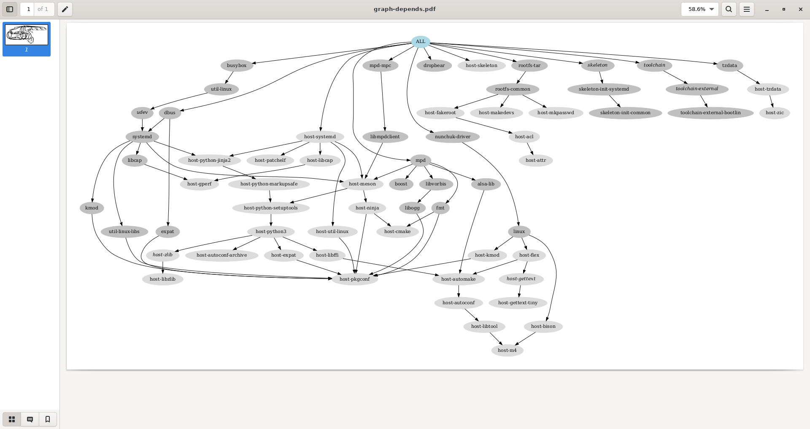

# System integration


## Objectives

* Get familiar with the `systemd` init system.

Compared to the previous lab, we go on increasing the complexity of the system, this time by using the systemd init system, and by taking advantage of it to add a few extra features, in particular ones that will be useful for debugging in the next lab.


## Setup

Since `systemd` requires the GNU C library, we are going to make a new *Buildroot* build in a new working directory, and using a different cross-compiling toolchain.

So, create the `$HOME/embedded-linux-bbb-labs/integration/` directory and go inside of it.

```console
$ LAB_PATH="$HOME/embedded-linux-bbb-labs/integration"
$ mkdir -p $LAB_PATH
$ cd $LAB_PATH
```

Make a new clone of *Buildroot* from the existing local *git* repository, and checkout our `embedded-linux-bbb` branch:

```console
$ git clone ../buildroot/buildroot/
$ cd buildroot/
$ git switch embedded-linux-bbb
```


## Root filesystem overlay

Remove `etc/init.d/` from the *root* filesystem overlay, because it was for *BusyBox*, not *systemd*.

```console
$ rm -rf board/bootlin/training/rootfs-overlay/etc/init.d/
```

## Buildroot configuration

Let's make a new *Buildroot* configuration from scratch.

```console
$ cd "$LAB_PATH/buildroot/"
$ make distclean
$ make menuconfig
$ cp .config ../buildroot.config
```


In `Target options`:

* `Target Architecture` = `ARM (little endian)`.

* `Target Architecture Variant` = `cortex-A8`.

* `Target ABI` = `EABIhf`.

* `Floating point strategy` = `VFPv3-D16`.


In `Toolchain`:

* `Toolchain type` = `External toolchain`.

* `Toolchain` = `Bootlin toolchains`.<br/>
  This time, we will use a *Bootlin* ready-made toolchain for `glibc`, as this is necessary for using *systemd*.

* `Toolchain origin` = `Toolchain to be downloaded and installed`.

* `Bootlin toolchain variant` = `armv7-eabihf glibc bleeding-edge 2021.11-1`.

* Enable `Copy gdb server to the Target`.


In `System configuration`:

* `Init system` = `systemd`.

* `Root filesystem overlay directories` = `board/bootlin/training/rootfs-overlay`.


In `Kernel`:

* Enable `Linux Kernel`.

* `Kernel version` = `Latest version (5.15)`.

* `Custom kernel patches` = `board/bootlin/training/0001-Custom-DTS-for-Bootlin-lab.patch`.

* `Kernel configuration` = `Using a custom (def)config file`.

* `Configuration file path` = `board/bootlin/training/linux.config`.

* Enable `Build a Device Tree Blob (DTB)`.

* `In-tree Device Tree Source file names` = `am335x-boneblack-custom`.


In `Target packages`:

* `Audio and video applications`:

    * Enable `mpd`, and in the submenu:

        * Keep only `alsa`, `vorbis`, and `tcp sockets`.

    * Enable `mpd-mpc`.

* `Hardware handling`:

    * Enable `nunchuk driver`.

* `Networking applications`:

    * Enable `dropbear`, a lightweight *SSH* server used instead of *OpenSSH* in most embedded devices.<br/>
      Disable `client programs`, which are not needed.


In `Filesystem images`:

* Enable `tar the root filesystem`.


## Build and test

Now build the full system.

```console
$ make
    ...
```

Once the build is over, generate the dependency graph again and find out the new dependencies
introduced by using systemd.

```
$ make graph-depends
    ...
$ evince output/graphs/graph-depends.pdf
$ cp output/graphs/graph-depends.pdf ../graph-depends.pdf
```



To test the new system, create a new `nfsroot` directory, extract then new *root* filesystem into it, and boot your board on it through NFS.

```console
$ cd "$LAB_PATH/buildroot/"
$ cp output/images/zImage /srv/tftp/
$ mkdir -p "$LAB_PATH/nfsroot/"
$ cd "$LAB_PATH/nfsroot/"
$ tar xfv "../buildroot/output/images/rootfs.tar"
$ sudo rm -f /srv/nfs
$ sudo ln -snv "$LAB_PATH/nfsroot/" /srv/nfs
'/srv/nfs' -> '/home/me/embedded-linux-bbb-labs/integration/nfsroot/'
$ sudo chown -R tftp:tftp /srv/nfs
$ sudo exportfs -ar
$ sudo systemctl restart nfs-kernel-server
```

You should see the system booting through *systemd*, with all the *systemd* targets and system services starting one by one, with a total boot time which looks slower than before.<br/>
That's because the system configuration is more complex, but also more versatile, being ready to run more complex services and applications.

You can ask *systemd* to show you the various running services:

```console title="picocomBBB - systemd"
# systemctl status
●
    State: degraded
     Jobs: 0 queued
   Failed: 1 units
    Since: Thu 1970-01-01 00:00:13 UTC; 52 years 0 months ago
   CGroup: /
           ├─init.scope
           │ └─1 /sbin/init
           └─system.slice
             ├─dbus.service
             │ └─165 /usr/bin/dbus-daemon --system --address=systemd: --no
             ├─dropbear.service
             │ └─171 /usr/sbin/dropbear -F -R
             ├─mpd.service
             │ └─167 /usr/bin/mpd --systemd
             ├─system-serial\x2dgetty.slice
             │ └─serial-getty@ttyS0.service
             │   ├─168 -sh
             │   ├─185 systemctl status
             │   └─186 less
             ├─systemd-journald.service
             │ └─92 /usr/lib/systemd/systemd-journald
             ├─systemd-networkd.service
             │ └─113 /usr/lib/systemd/systemd-networkd
             ├─systemd-resolved.service
             │ └─130 /usr/lib/systemd/systemd-resolved
             ├─systemd-timesyncd.service
             │ └─129 /usr/lib/systemd/systemd-timesyncd
             └─systemd-udevd.service
               └─104 /usr/lib/systemd/systemd-udevd

~
standard input lines 10-30/30 (END)
```

You can also check all the mounted filesystems and be impressed:

```console
# mount
192.168.0.15:/srv/nfs on / type nfs (rw,relatime,vers=3,rsize=4096,wsize=4096,namlen=255,hard,nolock,proto=tcp,timeo=600,retrans=2,sec=sys,mountaddr=192.168.0.15,mountvers=3,mountproto=tcp,local_lock=all,addr=192.168.0.15)
devtmpfs on /dev type devtmpfs (rw,relatime,size=242424k,nr_inodes=60606,mode=755)
proc on /proc type proc (rw,nosuid,nodev,noexec,relatime)
sysfs on /sys type sysfs (rw,nosuid,nodev,noexec,relatime)
tmpfs on /dev/shm type tmpfs (rw,nosuid,nodev)
devpts on /dev/pts type devpts (rw,nosuid,noexec,relatime,gid=5,mode=620,ptmxmode=000)
tmpfs on /run type tmpfs (rw,nosuid,nodev,size=100452k,nr_inodes=819200,mode=755)
cgroup2 on /sys/fs/cgroup type cgroup2 (rw,nosuid,nodev,noexec,relatime,nsdelegate,memory_recursiveprot)
mqueue on /dev/mqueue type mqueue (rw,nosuid,nodev,noexec,relatime)
debugfs on /sys/kernel/debug type debugfs (rw,nosuid,nodev,noexec,relatime)
tracefs on /sys/kernel/tracing type tracefs (rw,nosuid,nodev,noexec,relatime)
tmpfs on /tmp type tmpfs (rw,nosuid,nodev,nr_inodes=1048576)
configfs on /sys/kernel/config type configfs (rw,nosuid,nodev,noexec,relatime)
```


## Inspecting the system

On the *target*, look at the contents of `/lib/systemd/`.
You will see the implementation of most *systemd* targets and services.

```console title="picocomBBB - systemd"
# ls -p /lib/systemd/
libsystemd-shared-250.so         systemd-pstore
network/                         systemd-remount-fs
ntp-units.d/                     systemd-reply-password
resolv.conf                      systemd-resolved
system/                          systemd-shutdown
system-generators/               systemd-sleep
system-preset/                   systemd-socket-proxyd
system-shutdown/                 systemd-sulogin-shell
system-sleep/                    systemd-sysctl
systemd                          systemd-time-wait-sync
systemd-ac-power                 systemd-timedated
systemd-boot-check-no-failures   systemd-timesyncd
systemd-cgroups-agent            systemd-udevd
systemd-fsck                     systemd-update-done
systemd-growfs                   systemd-update-helper
systemd-hostnamed                systemd-vconsole-setup
systemd-journald                 systemd-xdg-autostart-condition
systemd-makefs                   user/
systemd-modules-load             user-environment-generators/
systemd-network-generator        user-generators/
systemd-networkd                 user-preset/
systemd-networkd-wait-online
```

In particular, check out `/lib/systemd/user/`, containing some unnecessary targets in our case, such as `bluetooth.target`.

```console title="picocomBBB - systemd"
# ls /lib/systemd/user/
app.slice                       session.slice
background.slice                shutdown.target
basic.target                    smartcard.target
bluetooth.target                sockets.target
default.target                  sound.target
exit.target                     systemd-exit.service
graphical-session-pre.target    systemd-tmpfiles-clean.service
graphical-session.target        systemd-tmpfiles-clean.timer
mpd.service                     systemd-tmpfiles-setup.service
mpd.socket                      timers.target
paths.target                    xdg-desktop-autostart.target
printer.target
```

However, check the `mpd.service` file for our *MPD* server.
This should help you to realize all the options provided by *systemd* to start and control system services, while keeping the system secure, and their resources under control.
You won't be able to match this level of control and security in a *hand-made* system.

```ini title="File: /lib/systemd/user/mpd.service"
[Unit]
Description=Music Player Daemon
Documentation=man:mpd(1) man:mpd.conf(5)
After=network.target sound.target

[Service]
Type=notify
ExecStart=/usr/bin/mpd --systemd

# Enable this setting to ask systemd to watch over MPD, see
# systemd.service(5).  This is disabled by default because it causes
# periodic wakeups which are unnecessary if MPD is not playing.
#WatchdogSec=120

# allow MPD to use real-time priority 40
LimitRTPRIO=40
LimitRTTIME=infinity

# for io_uring
LimitMEMLOCK=64M

# disallow writing to /usr, /bin, /sbin, ...
ProtectSystem=yes

# more paranoid security settings
NoNewPrivileges=yes
ProtectKernelTunables=yes
ProtectControlGroups=yes
# AF_NETLINK is required by libsmbclient, or it will exit() .. *sigh*
RestrictAddressFamilies=AF_INET AF_INET6 AF_UNIX AF_NETLINK
RestrictNamespaces=yes

# Note that "ProtectKernelModules=yes" is missing in the user unit
# because systemd 232 is unable to reduce its own capabilities
# ("Failed at step CAPABILITIES spawning /usr/bin/mpd: Operation not
# permitted")

[Install]
WantedBy=default.target
```


## Automatic module loading

Check the currently loaded modules on your system.

```console title="picocomBBB - systemd"
# lsmod
Module                  Size  Used by
input_leds             16384  0
hid_generic            16384  0
snd_usb_audio         217088  0
snd_hwdep              16384  1 snd_usb_audio
snd_usbmidi_lib        28672  1 snd_usb_audio
mc                     36864  1 snd_usb_audio
snd_rawmidi            28672  1 snd_usbmidi_lib
usbhid                 32768  0
joydev                 20480  0
snd_soc_hdmi_codec     16384  1
snd_soc_simple_card    16384  0
snd_soc_simple_card_utils    20480  1 snd_soc_simple_card
omap_aes_driver        24576  0
pm33xx                 16384  0
omap_crypto            16384  1 omap_aes_driver
omap_sham              28672  0
libaes                 16384  1 omap_aes_driver
ti_emif_sram           16384  1 pm33xx
crypto_engine          16384  2 omap_aes_driver,omap_sham
snd_soc_davinci_mcasp    28672  2
snd_soc_ti_udma        16384  1 snd_soc_davinci_mcasp
snd_soc_ti_edma        16384  1 snd_soc_davinci_mcasp
snd_soc_ti_sdma        16384  1 snd_soc_davinci_mcasp
tilcdc                 32768  0
snd_soc_core          172032  7 snd_soc_davinci_mcasp,snd_soc_hdmi_codec,snd_soc_simple_card_utils,snd_soc_ti_sdma,snd_soc_ti_edma,snd_soc_ti_udma,snd_soc_simple_card
snd_pcm_dmaengine      16384  1 snd_soc_core
snd_pcm               106496  5 snd_soc_davinci_mcasp,snd_usb_audio,snd_pcm_dmaengine,snd_soc_hdmi_codec,snd_soc_core
snd_timer              28672  1 snd_pcm
snd                    61440  8 snd_hwdep,snd_usb_audio,snd_soc_hdmi_codec,snd_timer,snd_rawmidi,snd_usbmidi_lib,snd_soc_core,snd_pcm
soundcore              16384  1 snd
nunchuk                16384  0
omap_mailbox           20480  1
tda998x                28672  0
drm_kms_helper        192512  3 tda998x,tilcdc
cfbfillrect            16384  1 drm_kms_helper
syscopyarea            16384  1 drm_kms_helper
rtc_omap               20480  2 pm33xx
cfbimgblt              16384  1 drm_kms_helper
sysfillrect            16384  1 drm_kms_helper
omap_wdt               16384  0
sysimgblt              16384  1 drm_kms_helper
fb_sys_fops            16384  1 drm_kms_helper
watchdog               20480  1 omap_wdt
wkup_m3_ipc            16384  1 pm33xx
cfbcopyarea            16384  1 drm_kms_helper
tps65218_pwrbutton     16384  0
drm                   385024  4 tda998x,tilcdc,drm_kms_helper
drm_panel_orientation_quirks    16384  1 drm
at24                   20480  0
wkup_m3_rproc          16384  1
cpufreq_dt             16384  0
sha256_generic         16384  0
libsha256              16384  1 sha256_generic
sha256_arm             24576  0
cfg80211              643072  0
```

Surprise: both the *Nunchuk* and USB audio modules are already loaded.
We didn't have anything to set up and *systemd* automatically load the modules associated to connected hardware.<br/>
Let's find out why.

On the target, go to `/lib/udev/rules.d/`.
You will find all the standard rules for *Udev*, the part of *systemd* which handles hardware events, takes care of the permissions and ownership of device files, notifies other userspace programs, and among others, loads kernel modules.

```console title="picocomBBB - systemd"
# ls /lib/udev/rules.d/
50-udev-default.rules             64-btrfs.rules
60-autosuspend.rules              70-camera.rules
60-block.rules                    70-joystick.rules
60-cdrom_id.rules                 70-memory.rules
60-drm.rules                      70-mouse.rules
60-evdev.rules                    70-touchpad.rules
60-fido-id.rules                  75-net-description.rules
60-input-id.rules                 75-probe_mtd.rules
60-persistent-alsa.rules          78-sound-card.rules
60-persistent-input.rules         80-drivers.rules
60-persistent-storage-tape.rules  80-net-setup-link.rules
60-persistent-storage.rules       81-net-dhcp.rules
60-persistent-v4l.rules           90-vconsole.rules
60-sensor.rules                   99-systemd.rules
60-serial.rules                   README
```

Open `80-drivers.rules`, which is the rule allowing *Udev* to load kernel modules for detected devices.<br/>
Its most important line defines `MODALIAS`:

```make title="File: /lib/udev/rules.d/80-drivers.rules" hl_lines="5"
# do not edit this file, it will be overwritten on update

ACTION!="add", GOTO="drivers_end"

ENV{MODALIAS}=="?*", RUN{builtin}+="kmod load '$env{MODALIAS}'"
SUBSYSTEM=="tifm", ENV{TIFM_CARD_TYPE}=="SD", RUN{builtin}+="kmod load tifm_sd"
SUBSYSTEM=="tifm", ENV{TIFM_CARD_TYPE}=="MS", RUN{builtin}+="kmod load tifm_ms"
SUBSYSTEM=="memstick", RUN{builtin}+="kmod load ms_block mspro_block"
SUBSYSTEM=="i2o", RUN{builtin}+="kmod load i2o_block"
SUBSYSTEM=="module", KERNEL=="parport_pc", RUN{builtin}+="kmod load ppdev"
KERNEL=="mtd*ro", ENV{MTD_FTL}=="smartmedia", RUN{builtin}+="kmod load sm_ftl"

LABEL="drivers_end"
```

This is when the `modules.alias` file comes into play.<br/>
When a new device is found, the kernel passes a `MODALIAS` environment variable to *Udev*, containing which bus this happened on, and the attributes of the device on this bus.
Thanks to the module aliases, the right module gets loaded.
We already explained that [in the lectures](hardware.md) when talking about the output of `make modules_install`.

Find where the `modules.alias` file is located, and you will find the two lines that allowed to load
our `snd_usb_audio` and `nunchuk` modules:

```console title="picocomBBB - systemd"
# modules_alias_path=$(find / -name modules.alias)
# echo $modules_alias_path
/usr/lib/modules/5.15.26/modules.alias
# cat $modules_alias_path | grep snd_usb_audio
    ...
alias usb:v*p*d*dc*dsc*dp*ic01isc01ip*in* snd_usb_audio
alias usb:v046Dp0A38d*dc*dsc*dp*ic*isc*ip*in* snd_usb_audio
    ...
# cat $modules_alias_path | grep nunchuk
alias of:N*T*Cnintendo,nunchukC* nunchuk
alias of:N*T*Cnintendo,nunchuk nunchuk
```

For `snd_usb_audio`, there are many possible matching values, so it isn't straighforward to be
sure which matched your particular device.

However, you can find in *sysfs* which `MODALIAS` was emitted for your device:

```console title="picocomBBB - systemd" hl_lines="14"
# cd /sys/class/sound/card0/device/
# ls -la
total 0
drwxr-xr-x    4 root     root             0 Jan 18  2022 .
drwxr-xr-x    8 root     root             0 Jan 18  2022 ..
-rw-r--r--    1 root     root          4096 May  6 11:15 authorized
-r--r--r--    1 root     root          4096 May  6 11:15 bAlternateSetting
-r--r--r--    1 root     root          4096 May  6 11:15 bInterfaceClass
-r--r--r--    1 root     root          4096 May  6 11:15 bInterfaceNumber
-r--r--r--    1 root     root          4096 May  6 11:15 bInterfaceProtocol
-r--r--r--    1 root     root          4096 May  6 11:15 bInterfaceSubClass
-r--r--r--    1 root     root          4096 May  6 11:15 bNumEndpoints
lrwxrwxrwx    1 root     root             0 May  6 11:15 driver -> ../../../../../../../../../bus/usb/drivers/snd-usb-audio
-r--r--r--    1 root     root          4096 May  6 11:15 modalias
drwxr-xr-x    2 root     root             0 May  6 11:15 power
drwxr-xr-x    3 root     root             0 May  6 11:15 sound
lrwxrwxrwx    1 root     root             0 Jan 18  2022 subsystem -> ../../../../../../../../../bus/usb
-r--r--r--    1 root     root          4096 May  6 11:15 supports_autosuspend
-rw-r--r--    1 root     root          4096 Jan 18  2022 uevent
# cat modalias
usb:v046Dp0A38d0115dc00dsc00dp00ic01isc01ip00in00
```

With a bit of patience, you could find the matching line within the `modules.alias` file.

If you want to see the information sent to *Udev* by the kernel when a new device is plugged in, here are a few debugging commands.

First unplug your device and run `udevadm monitor`.<br/>
Then plug in your headset again. You will find all the events emitted by the kernel, and with the same string (with `UDEV` instead of `KERNEL`), the time when *Udev* finished processing each event.

```console title="picocomBBB - systemd"
# udevadm monitor
monitor will print the received events for:
UDEV - the event which udev sends out after rule processing
KERNEL - the kernel uevent

[ 1602.288834] usb 1-1: new full-speed USB device number 5 using musb-hdrc
[ 1602.670092] usb 1-1: New USB device found, idVendor=046d, idProduct=0a38, bcdDevice= 1.15
[ 1602.678406] usb 1-1: New USB device strings: Mfr=1, Product=2, SerialNumber=0
[ 1602.685741] usb 1-1: Product: Logitech USB Headset H340
[ 1602.691101] usb 1-1: Manufacturer: Logitech Inc.
KERNEL[1602.716705] add      /devices/platform/ocp/47400000.target-module/47401c00.usb/musb-hdrc.1/usb1/1-1 (usb)
KERNEL[1602.722002] add      /devices/platform/ocp/47400000.target-module/47401c00.usb/musb-hdrc.1/usb1/1-1/1-1:1.0 (usb)
KERNEL[1602.849792] add      /devices/platform/ocp/47400000.target-module/47401c00.usb/musb-hdrc.1/usb1/1-1/1-1:1.0/sound/card0 (sound)
KERNEL[1602.853994] add      /devices/platform/ocp/4740[ 1602.870857] PM: Cannot get wkup_m3_ipc handle
0000.target-module/47401c00.usb/musb-hdrc.1/usb1/1-1/1-1:1.0/sound/card0/pcmC0D0p (sound)
KERNEL[1602.858805] add      /devices/platform/ocp/47400000.target-module/47401c00.usb/musb-hdrc.1/usb1/1-1/1-1:1.0/sound/card0/pcmC0D0c (sound)
KERNEL[1602.872313] add      /devices/platform/ocp/47400000.target-module/47401c00.usb/musb-hdrc.1/usb1/1-1/1-1:1.0/sound/card0/controlC0 (sound)
KERNEL[1602.873192] bind     /devices/platform/ocp/47400000.target-module/47401c00.usb/musb-hdrc.1/usb1/1-1/1-1:1.0 (usb)
KERNEL[1602.873919] add      /devices/platform/ocp/47400000.target-module/47401c00.usb/musb-hdrc.1/usb1/1-1/1-1:1.1 (usb)
KERNEL[1602.874634] bind     /devices/platform/ocp/47400000.target-module/47401c00.usb/musb-hdrc.1/usb1/1-1/1-1:1.1 (usb)
KERNEL[1602.875370] add      /devices/platform/ocp/47400000.target-module/47401c00.usb/musb-hdrc.1/usb1/1-1/1-1:1.2 (usb)
KERNEL[1602.876096] bind     /devices/platform/ocp/47400000.target-module/47401c00.usb/musb-hdrc.1/usb1/1-1/1-1:1.2 (usb)
KERNEL[1602.876771] add  [ 1602.964976] input: Logitech Inc. Logitech USB Headset H340 Consumer Control as /devices/platform/ocp/47400000.target-module/47401c00.usb/musb-hdrc.1/usb1/1-1/1-1:1.3/0003:046D:0A38.0004/input/input7
    /devices/platform/ocp/47400000.target-module/47401c00.usb/musb-hdrc.1/usb1/1-1/1-1:1.3 (usb)
KERNEL[1602.949111] add      /devices/platform/ocp/47400000.target-module/47401c00.usb/musb-hdrc.1/usb1/1-1/1-1:1.3/0003:046D:0A38.0004 (hid)
KERNEL[1602.980402] add      /devices/platform/ocp/47400000.target-module/47401c00.usb/musb-hdrc.1/usb1/1-1/1-1:1.3/0003:046D:0A38.0004/input/input7 (input)
[ 1603.049480] input: Logitech Inc. Logitech USB Headset H340 as /devices/platform/ocp/47400000.target-module/47401c00.usb/musb-hdrc.1/usb1/1-1/1-1:1.3/0003:046D:0A38.0004/input/input8
KERNEL[1603.057724] add      /devices/platform/ocp/47400000.target-module/47401c00.usb/musb-hdrc.1/usb1/1-1/1-1:1.3/0003:046D:0A[ 1603.076705] hid-generic 0003:046D:0A38.0004: input,hiddev96: USB HID v1.11 Device [Logitech Inc. Logitech USB Headset H340] on usb-musb-hdrc.1-1/input3
38.0004/input/input7/event1 (input)
KERNEL[1603.058370] add    [ 1603.094087] PM: Cannot get wkup_m3_ipc handle
  /devices/platform/ocp/47400000.target-module/47401c00.usb/musb-hdrc.1/usb1/1-1/1-1:1.3/0003:046D:0A38.0004/input/input8 (input)
KERNEL[1603.063218] add      /devices/platform/ocp/47400000.target-module/47401c00.usb/musb-hdrc.1/usb1/1-1/1-1:1.3/0003:046D:0A38.0004/input/input8/event2 (input)
KERNEL[1603.063593] add      /devices/platform/ocp/47400000.target-module/47401c00.usb/musb-hdrc.1/usb1/1-1/1-1:1.3/0003:046D:0A38.0004/input/input8/input8::mute (leds)
KERNEL[1603.063797] add      /class/usbmisc (class)
KERNEL[1603.083788] add      /devices/platform/ocp/47400000.target-module/47401c00.usb/musb-hdrc.1/usb1/1-1/1-1:1.3/usbmisc/hiddev0 (usbmisc)
KERNEL[1603.084236] bind     /devices/platform/ocp/47400000.target-module/47401c00.usb/musb-hdrc.1/usb1/1-1/1-1:1.3/0003:046D:0A38.0004 (hid)
KERNEL[1603.084543] bind     /devices/platform/ocp/47400000.target-module/47401c00.usb/musb-hdrc.1/usb1/1-1/1-1:1.3 (usb)
KERNEL[1603.084907] bind     /devices/platform/ocp/47400000.target-module/47401c00.usb/musb-hdrc.1/usb1/1-1 (usb)
UDEV  [1603.110810] add      /devices/platform/ocp/47400000.target-module/47401c00.usb/musb-hdrc.1/usb1/1-1 (usb)
UDEV  [1603.118580] add      /class/usbmisc (class)
UDEV  [1603.129548] add      /devices/platform/ocp/47400000.target-module/47401c00.usb/musb-hdrc.1/usb1/1-1/1-1:1.0 (usb)
UDEV  [1603.163585] add      /devices/platform/ocp/47400000.target-module/47401c00.usb/musb-hdrc.1/usb1/1-1/1-1:1.0/sound/card0 (sound)
UDEV  [1603.177859] add      /devices/platform/ocp/47400000.target-module/47401c00.usb/musb-hdrc.1/usb1/1-1/1-1:1.0/sound/card0/pcmC0D0c (sound)
UDEV  [1603.183681] add      /devices/platform/ocp/47400000.target-module/47401c00.usb/musb-hdrc.1/usb1/1-1/1-1:1.0/sound/card0/pcmC0D0p (sound)
UDEV  [1603.195790] add      /devices/platform/ocp/47400000.target-module/47401c00.usb/musb-hdrc.1/usb1/1-1/1-1:1.2 (usb)
UDEV  [1603.203962] add      /devices/platform/ocp/47400000.target-module/47401c00.usb/musb-hdrc.1/usb1/1-1/1-1:1.1 (usb)
UDEV  [1603.218135] bind     /devices/platform/ocp/47400000.target-module/47401c00.usb/musb-hdrc.1/usb1/1-1/1-1:1.1 (usb)
UDEV  [1603.221134] add      /devices/platform/ocp/47400000.target-module/47401c00.usb/musb-hdrc.1/usb1/1-1/1-1:1.3 (usb)
UDEV  [1603.227523] add      /devices/platform/ocp/47400000.target-module/47401c00.usb/musb-hdrc.1/usb1/1-1/1-1:1.3/0003:046D:0A38.0004 (hid)
UDEV  [1603.236292] bind     /devices/platform/ocp/47400000.target-module/47401c00.usb/musb-hdrc.1/usb1/1-1/1-1:1.2 (usb)
UDEV  [1603.251374] add      /devices/platform/ocp/47400000.target-module/47401c00.usb/musb-hdrc.1/usb1/1-1/1-1:1.3/usbmisc/hiddev0 (usbmisc)
KERNEL[1603.267946] change   /devices/platform/ocp/47400000.target-module/47401c00.usb/musb-hdrc.1/usb1/1-1/1-1:1.0/sound/card0 (sound)
UDEV  [1603.293198] add      /devices/platform/ocp/47400000.target-module/47401c00.usb/musb-hdrc.1/usb1/1-1/1-1:1.3/0003:046D:0A38.0004/input/input8 (input)
UDEV  [1603.300618] add      /devices/platform/ocp/47400000.target-module/47401c00.usb/musb-hdrc.1/usb1/1-1/1-1:1.3/0003:046D:0A38.0004/input/input7 (input)
UDEV  [1603.301505] add      /devices/platform/ocp/47400000.target-module/47401c00.usb/musb-hdrc.1/usb1/1-1/1-1:1.0/sound/card0/controlC0 (sound)
UDEV  [1603.317818] bind     /devices/platform/ocp/47400000.target-module/47401c00.usb/musb-hdrc.1/usb1/1-1/1-1:1.0 (usb)
UDEV  [1603.332349] add      /devices/platform/ocp/47400000.target-module/47401c00.usb/musb-hdrc.1/usb1/1-1/1-1:1.3/0003:046D:0A38.0004/input/input8/input8::mute (leds)
UDEV  [1603.387225] add      /devices/platform/ocp/47400000.target-module/47401c00.usb/musb-hdrc.1/usb1/1-1/1-1:1.3/0003:046D:0A38.0004/input/input7/event1 (input)
UDEV  [1603.396360] add      /devices/platform/ocp/47400000.target-module/47401c00.usb/musb-hdrc.1/usb1/1-1/1-1:1.3/0003:046D:0A38.0004/input/input8/event2 (input)
UDEV  [1603.396747] bind     /devices/platform/ocp/47400000.target-module/47401c00.usb/musb-hdrc.1/usb1/1-1/1-1:1.3/0003:046D:0A38.0004 (hid)
UDEV  [1603.407306] bind     /devices/platform/ocp/47400000.target-module/47401c00.usb/musb-hdrc.1/usb1/1-1/1-1:1.3 (usb)
UDEV  [1603.417180] bind     /devices/platform/ocp/47400000.target-module/47401c00.usb/musb-hdrc.1/usb1/1-1 (usb)
UDEV  [1603.427970] change   /devices/platform/ocp/47400000.target-module/47401c00.usb/musb-hdrc.1/usb1/1-1/1-1:1.0/sound/card0 (sound)
```

You can also see the `MODALIAS` values carried by these events:

```console title="picocomBBB - systemd"
# udevadm monitor --env
    ...

UDEV  [1763.405675] change   /devices/platform/ocp/47400000.target-module/47401c00.usb/musb-hdrc.1/usb1/1-1/1-1:1.0/sound/card0 (sound)
ACTION=change
DEVPATH=/devices/platform/ocp/47400000.target-module/47401c00.usb/musb-hdrc.1/usb1/1-1/1-1:1.0/sound/card0
SUBSYSTEM=sound
SYNTH_UUID=0
SEQNUM=2433
USEC_INITIALIZED=1761986039
SOUND_INITIALIZED=1
ID_VENDOR=Logitech_Inc.
ID_VENDOR_ENC=Logitech\x20Inc.
ID_VENDOR_ID=046d
ID_MODEL=Logitech_USB_Headset_H340
ID_MODEL_ENC=Logitech\x20USB\x20Headset\x20H340
ID_MODEL_ID=0a38
ID_REVISION=0115
ID_SERIAL=Logitech_Inc._Logitech_USB_Headset_H340
ID_TYPE=audio
ID_BUS=usb
ID_USB_INTERFACES=:010100:010200:030000:
ID_USB_INTERFACE_NUM=00
ID_USB_DRIVER=snd-usb-audio
ID_ID=usb-Logitech_Inc._Logitech_USB_Headset_H340-00
ID_PATH=platform-musb-hdrc.1-usb-0:1:1.0
ID_PATH_TAG=platform-musb-hdrc_1-usb-0_1_1_0
SOUND_FORM_FACTOR=headset
```

As far as the *Nunchuk* is concerned, we cannot easily remove it from the *Device Tree* and add it back, but it's easier to find its `MODALIAS` value:

```console title="picocomBBB - systemd" hl_lines="10"
# cd /sys/bus/i2c/devices/
# ls -la
total 0
drwxr-xr-x    2 root     root             0 Jan 18  2022 .
drwxr-xr-x    4 root     root             0 Jan 18  2022 ..
lrwxrwxrwx    1 root     root             0 Jan 18  2022 0-0024 -> ../../../devices/platform/ocp/44c00000.interconnect/44c00000.interconnect:segment@200000/44e0b000.target-module/44e0b000.i2c/i2c-0/0-0024
lrwxrwxrwx    1 root     root             0 May  6 11:18 0-0034 -> ../../../devices/platform/ocp/44c00000.interconnect/44c00000.interconnect:segment@200000/44e0b000.target-module/44e0b000.i2c/i2c-0/0-0034
lrwxrwxrwx    1 root     root             0 Jan 18  2022 0-0050 -> ../../../devices/platform/ocp/44c00000.interconnect/44c00000.interconnect:segment@200000/44e0b000.target-module/44e0b000.i2c/i2c-0/0-0050
lrwxrwxrwx    1 root     root             0 Jan 18  2022 0-0070 -> ../../../devices/platform/ocp/44c00000.interconnect/44c00000.interconnect:segment@200000/44e0b000.target-module/44e0b000.i2c/i2c-0/0-0070
lrwxrwxrwx    1 root     root             0 Jan 18  2022 1-0052 -> ../../../devices/platform/ocp/48000000.interconnect/48000000.interconnect:segment@0/4802a000.target-module/4802a000.i2c/i2c-1/1-0052
lrwxrwxrwx    1 root     root             0 Jan 18  2022 2-0054 -> ../../../devices/platform/ocp/48000000.interconnect/48000000.interconnect:segment@100000/4819c000.target-module/4819c000.i2c/i2c-2/2-0054
lrwxrwxrwx    1 root     root             0 Jan 18  2022 2-0055 -> ../../../devices/platform/ocp/48000000.interconnect/48000000.interconnect:segment@100000/4819c000.target-module/4819c000.i2c/i2c-2/2-0055
lrwxrwxrwx    1 root     root             0 Jan 18  2022 2-0056 -> ../../../devices/platform/ocp/48000000.interconnect/48000000.interconnect:segment@100000/4819c000.target-module/4819c000.i2c/i2c-2/2-0056
lrwxrwxrwx    1 root     root             0 Jan 18  2022 2-0057 -> ../../../devices/platform/ocp/48000000.interconnect/48000000.interconnect:segment@100000/4819c000.target-module/4819c000.i2c/i2c-2/2-0057
lrwxrwxrwx    1 root     root             0 Jan 18  2022 i2c-0 -> ../../../devices/platform/ocp/44c00000.interconnect/44c00000.interconnect:segment@200000/44e0b000.target-module/44e0b000.i2c/i2c-0
lrwxrwxrwx    1 root     root             0 Jan 18  2022 i2c-1 -> ../../../devices/platform/ocp/48000000.interconnect/48000000.interconnect:segment@0/4802a000.target-module/4802a000.i2c/i2c-1
lrwxrwxrwx    1 root     root             0 Jan 18  2022 i2c-2 -> ../../../devices/platform/ocp/48000000.interconnect/48000000.interconnect:segment@100000/4819c000.target-module/4819c000.i2c/i2c-2
```

Here you will recognize our *Nunchuk* device through its `0x52` address.

```console title="picocomBBB - systemd"
# cd "1-0052/"
# ls -la
total 0
drwxr-xr-x    4 root     root             0 Jan 18  2022 .
drwxr-xr-x    5 root     root             0 Jan 18  2022 ..
lrwxrwxrwx    1 root     root             0 May  6 11:15 driver -> ../../../../../../../../../bus/i2c/drivers/nunchuk
drwxr-xr-x    3 root     root             0 May  6 11:15 input
-r--r--r--    1 root     root          4096 May  6 11:19 modalias
-r--r--r--    1 root     root          4096 Jan  1  2000 name
lrwxrwxrwx    1 root     root             0 May  6 11:19 of_node -> ../../../../../../../../../firmware/devicetree/base/ocp/interconnect@48000000/segment@0/target-module@2a000/i2c@0/joystick@52
drwxr-xr-x    2 root     root             0 May  6 11:19 power
lrwxrwxrwx    1 root     root             0 Jan 18  2022 subsystem -> ../../../../../../../../../bus/i2c
-rw-r--r--    1 root     root          4096 Jan 18  2022 uevent
# cat modalias
of:NjoystickT(null)Cnintendo,nunchuk
```

Here the bus is `of`, meaning *Open Firmware*, which was the former name of the *Device Tree*.<br/>
When an event was emitted by the kernel with this `MODALIAS` string, the `nunchuk` module got loaded by *Udev* thanks to the matching alias.

This actually happened when *systemd* ran the *coldplugging* operation: at system startup, it asked the kernel to emit *hotplug* events for devices already present when the system booted:

```
[ OK ] Finished Coldplug All udev Devices.
```

On non-*x86* platforms, that's typically for devices described in the *Device Tree*.<br/>
This way, both *static* and *hotplugged* devices can be handled in the same way, using the same *Udev* rules.


## Testing

Make sure that audio playback still works on your system:

```console title="picocomBBB - systemd"
# mpc update
Updating DB (#1) ...
volume:100%   repeat: off   random: off   single: off   consume: off
# mpc add /
# mpc play
1-sample.ogg
[playing] #1/7   0:00/0:19 (0%)
volume:100%   repeat: off   random: off   single: off   consume: off
# mpc stop
volume:100%   repeat: off   random: off   single: off   consume: off
```

If it doesn't, look at the *systemd* logs in your serial console history (`dmesg`).
*systemd* should let you know about the failing services and the commands to run to get more details.


## Backup and restore

```console
$ cd "$LAB_PATH/buildroot/output/images/"
$ tar cfJv "$LAB_PATH/integration-images.tar.xz" *
```

## Licensing

This document is an extension to: [*Embedded Linux System Development - Practical Labs - BeagleBone Black Variant*](https://bootlin.com/doc/training/embedded-linux-bbb/)
 &mdash; &copy; 2004-2023, *Bootlin* [https://bootlin.com/](https://bootlin.com), [`CC-BY-SA-3.0`]((https://creativecommons.org/licenses/by-sa/3.0/)) license.
