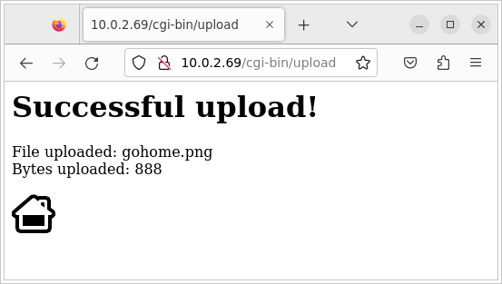
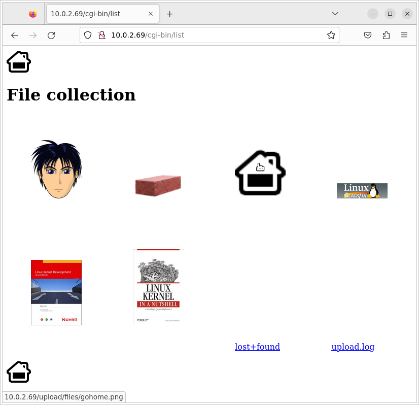

# Block Filesystems


## Objectives

* Produce filesystem images.

* Configure the kernel to use these filesystems.

* Use the `tmpfs` filesystem to store temporary files.

* Load the kernel and DTB from a FAT partition.

After doing the *BusyBox* lab, we are going to copy the filesystem contents to the emulated SD card.
The storage will be split into several partitions, and your QEMU emulated board will be booted from this SD card, without using NFS anymore.


## Setup

Throughout this lab, we will continue to use the root filesystem we have created in the `$HOME/embedded-linux-qemu-labs/tinysystem/nfsroot` directory, which we will progressively adapt to use block filesystems.

```console
$ LAB_PATH="$HOME/embedded-linux-qemu-labs/tinysystem"
```


## Filesystem support in the kernel

Make sure that your kernel supports *SquashFS* (`SQUASHFS`) and *ext4* (`EXT4_FS`).
Basic configuration options for these filesystems will be sufficient; no need for things like extended attributes.

```console
$ cd "$LAB_PATH/../kernel/linux"
$ grep -r "\bCONFIG_SQUASHFS\b" .config
CONFIG_SQUASHFS=y
$ grep -r "\bCONFIG_EXT4_FS\b" .config
CONFIG_EXT4_FS=y
```

If necessary, recompile and update your kernel image on the TFTP server.
We will only later copy the kernel to our FAT partition.

Boot your board on the NFS filesystem you used in this previous lab.<br/>
Now, check the contents of `/proc/filesystems`. You should see that *ext4* and *SquashFS* are supported.

```console title="QEMU - BusyBox" hl_lines="17 20"
# cat /proc/filesystems
nodev   sysfs
nodev   tmpfs
nodev   bdev
nodev   proc
nodev   cgroup
nodev   cgroup2
nodev   cpuset
nodev   devtmpfs
nodev   tracefs
nodev   sockfs
nodev   pipefs
nodev   ramfs
nodev   rpc_pipefs
nodev   devpts
        ext3
        ext4
        ext2
        cramfs
        squashfs
        vfat
nodev   nfs
nodev   jffs2
nodev   9p
nodev   ubifs
```

## Format the third partition

We are going to format the third partition of the SD card image with the EXT4 filesystem, so that it can contain uploaded images.

Setup the loop device again and format the third partition:

```console
$ cd "$LAB_PATH/../bootloader/"
$ LOOP_DEV=$(sudo losetup -f --show --partscan sd.img)
$ sudo mkfs.ext4 -L data "${LOOP_DEV}p3"
    ...
```

Mount this partition on a directory on your host (you could create the `/mnt/www_upload_files` directory, for example) and move the contents of the `/www/upload/files` directory (in your target *root* filesystem) into it.
The goal is to use the third partition of the SD card as the storage for the uploaded images.<br/>
Finally, unmount the partition and free the allocated *loop* device.

```console
$ mnt_path="/mnt/www_upload_files"
$ sudo mkdir -p $mnt_path
$ sudo mount -t ext4 "${LOOP_DEV}p3" $mnt_path
$ cd "$LAB_PATH/nfsroot/www/upload/files/"
$ sudo cp -rv $(ls) $mnt_path
'adult-small.png' -> '/mnt/www_upload_files/adult-small.png'
'brick.png' -> '/mnt/www_upload_files/brick.png'
'linux-blackfin.jpg' -> '/mnt/www_upload_files/linux-blackfin.jpg'
'linux-kernel-dev-book.jpg' -> '/mnt/www_upload_files/linux-kernel-dev-book.jpg'
'lkn-small.jpg' -> '/mnt/www_upload_files/lkn-small.jpg'
$ sudo umount $mnt_path
$ sudo rmdir $mnt_path
$ sudo losetup -d $LOOP_DEV
```

Now, restart *QEMU* and from the Linux command line and mount this third partition on `/www/upload/files`.

```console title="QEMU - BusyBox" hl_lines="7 11"
# ls /www/upload/files/
adult-small.png            linux-kernel-dev-book.jpg
brick.png                  lkn-small.jpg
linux-blackfin.jpg
# rm -rf /www/upload/files/*
# mount -t ext4 /dev/mmcblk0p3 /www/upload/files/
EXT4-fs (mmcblk0p3): mounted filesystem with ordered data mode. Opts: (null). Quota mode: disabled.
# ls /www/upload/files/
adult-small.png            linux-kernel-dev-book.jpg
brick.png                  lkn-small.jpg
linux-blackfin.jpg         lost+found
```

Once this works, modify the startup scripts in your root filesystem to do it automatically at boot time.

```console
$ cat > etc/init.d/rcS <<'EOF'
#!/bin/sh
mount -t proc proc /proc
mount -t sysfs sys /sys
mount -t ext4 /dev/mmcblk0p3 /www/upload/files/
/usr/sbin/httpd -h /www/
EOF
```

Reboot your target system again. With the `mount` command, check that `/www/upload/files` is now a mount point for the third SD card partition.

Also make sure that you can still upload new images, and that these images are listed in the web interface.
For example, upload the file `$LAB_PATH/nfsroot/www/gohome.png`.

```console title="QEMU - BusyBox" hl_lines="8 14"
# reboot
    ...
# mount
10.0.2.15:/srv/nfs on / type nfs (rw,relatime,vers=3,rsize=4096,wsize=4096,namlen=255,hard,nolock,proto=tcp,timeo=600,retrans=2,sec=sys,mountaddr=10.0.2.15,mountvers=3,mountproto=tcp,local_lock=all,addr=10.0.2.15)
devtmpfs on /dev type devtmpfs (rw,relatime,size=50532k,nr_inodes=12633,mode=755)
proc on /proc type proc (rw,relatime)
sys on /sys type sysfs (rw,relatime)
/dev/mmcblk0p3 on /www/upload/files type ext4 (rw,relatime)
# echo "Upload gohome.png from the web interface, please!"
    ...
# ls /www/upload/files/
adult-small.png            linux-kernel-dev-book.jpg
brick.png                  lkn-small.jpg
gohome.png                 lost+found
linux-blackfin.jpg         upload.log
```

You can now `halt` and quit *QEMU*.






## Adding a `tmpfs` partition for log files

Currently, the upload script was storing its log file in `/www/upload/files/upload.log`.<br/>
To avoid seeing this log file in the directory containing uploaded files, let’s store it into `/var/log` instead.

Add the `/var/log/` directory to your *root* filesystem, and modify the startup script to mount a `tmpfs` filesystem to this directory.<br/>
You can test your `tmpfs` mount command line on the system before adding it to the startup script, in order to be sure that it works properly. Note that for types of `tmpfs` and `sysfs` the device name is just ignored, so we can just name them after the type.

```console
$ cd "$LAB_PATH/nfsroot/"
$ mkdir -p var/log/
$ cat > etc/init.d/rcS <<'EOF'
#!/bin/sh
mount -t proc proc /proc
mount -t sysfs sysfs /sys
mount -t tmpfs tmpfs /var/log/
mount -t ext4 /dev/mmcblk0p3 /www/upload/files/
/usr/sbin/httpd -h /www/
EOF
```

Modify the `www/cgi-bin/upload.cfg` configuration file to store the log file in `/var/log/upload.log`.
You will lose your log file each time you reboot your system, but that’s OK in our system.<br/>
That’s what `tmpfs` is for: temporary data that you don’t need to keep across system reboots.

```console hl_lines="8"
$ nano www/cgi-bin/upload.cfg
$ cat www/cgi-bin/upload.cfg
Config          = Default
  Root          = /www/upload/files
  FileMask      = *
  IgnoreSubdirs = YES
  Overwrite     = YES
  LogFile       = /var/log/upload.log
  OkPage        = /www/upload/OkPage.html
  BadPage       = /www/upload/BadPage.html
  Debug         = 0
```

Reboot your system and check that it works as expected, by uploading `gohome.png` again.

```console title="QEMU - BusyBox" hl_lines="9 17 20 24"
# reboot
    ...
# mount
10.0.2.15:/srv/nfs on / type nfs (rw,relatime,vers=3,rsize=4096,wsize=4096,namlen=255,hard,nolock,proto=tcp,timeo=600,retrans=2,sec=sys,mountaddr=10.0.2.15,mountvers=3,mountproto=tcp,local_lock=all,addr=10.0.2.15)
devtmpfs on /dev type devtmpfs (rw,relatime,size=50532k,nr_inodes=12633,mode=755)
proc on /proc type proc (rw,relatime)
sysfs on /sys type sysfs (rw,relatime)
tmpfs on /var/log type tmpfs (rw,relatime)
/dev/mmcblk0p3 on /www/upload/files type ext4 (rw,relatime)
# rm -v /www/upload/files/gohome.png
removed '/www/upload/files/gohome.png'
# echo "Upload gohome.png from the web interface, please!"
    ...
# ls /www/upload/files/
adult-small.png            linux-kernel-dev-book.jpg
brick.png                  lkn-small.jpg
gohome.png                 lost+found
linux-blackfin.jpg         upload.log
# cat /var/log/upload.log
Sat Apr  8 16:26:56 2023 File uploaded succesfully: gohome.png (888 bytes)
# reboot
    ...
# cat /var/log/upload.log
cat: can't open '/var/log/upload.log': No such file or directory
```

You can now `halt` and quit *QEMU*.


## Making a SquashFS image

We are going to store the root filesystem in a *SquashFS* filesystem in the second partition of the SD card.<br/>
In order to create *SquashFS* images on your *host*, you need to install the `squashfs-tools` package.

```console
$ sudo apt install squashfs-tools
```

Then, create a *SquashFS* image of your NFS *root* directory with `mksquashfs`.<br/>
Setup the *loop* device again. Using the `dd` command, copy the filesystem image to the second partition (named `image`) in the SD card image. Finally, unmount and cleanup.

```console
$ cd "$LAB_PATH/../bootloader/"
$ LOOP_DEV=$(sudo losetup -f --show --partscan sd.img)
$ sudo mkfs.ext4 -L image "${LOOP_DEV}p2"
    ...
$ sudo dd if="$LAB_PATH/nfsroot.sqsh" of="${LOOP_DEV}p2"
912+0 records in
912+0 records out
466944 bytes (467 kB, 456 KiB) copied, 0.0144154 s, 32.4 MB/s
$ sudo losetup -d $LOOP_DEV
```


## Booting on the SquashFS partition

In the *U-boot* shell, configure the kernel command line to use the second partition of the SD card as the root file system.<br/>
Also add the `rootwait` boot argument, to wait for the SD card to be properly initialized before trying to mount the *root* filesystem.<br/>
Since the SD cards are detected asynchronously by the kernel, the kernel might try to mount the *root* filesystem too early without `rootwait`.<br/>
Check that your system still works. Congratulations if it does!

``` title="QEMU - U-Boot" hl_lines="5"
=> setenv bootargs console=ttyAMA0 root=/dev/mmcblk0p2 rootwait ip=${ipaddr}::${serverip}:${netmask}::
=> saveenv
=> reset
    ...
VFS: Mounted root (squashfs filesystem) readonly on device 179:2.
    ...
Please press Enter to activate this console.
```

Now `halt` and quit *QEMU*.


## Store the kernel image and DTB on the SD card

Setup the *loop* device again, and mount the FAT partition (the first one) in the SD card image, for example on `/mnt/sd_boot`. It should contain only the latest saved *U-Boot* environment.<br/>
Then, copy the kernel image and DTB to it.<br/>
FInally, unmount the FAT partition and release the *loop* device.

```console
$ cd "$LAB_PATH/../bootloader/"
$ LOOP_DEV=$(sudo losetup -f --show --partscan sd.img)
$ mnt_path="/mnt/sd_boot"
$ sudo mkdir -p $mnt_path
$ sudo mount -t vfat "${LOOP_DEV}p1" $mnt_path
$ ls /mnt/sd_boot/
uboot.env
$ sudo cp /srv/tftp/zImage /srv/tftp/*.dtb $mnt_path
$ ls /mnt/sd_boot/
uboot.env  vexpress-v2p-ca9.dtb  zImage
$ sudo umount $mnt_path
$ sudo rmdir $mnt_path
$ sudo losetup -d $LOOP_DEV
```

You now need to adjust the `bootcmd` of *U-Boot* so that it loads kernel and from the SD card, instead of loading them from the network via TFTP.<br/>
In *U-boot*, you can load a file from a FAT filesystem using the `fatload` command, which expects: the device, the partition, the load address, and the source filename.<br/>
Compare the previous and the new `bootcmd`. Finally, `reset` to reboot the board and make sure that your system still boots fine.

``` title="QEMU - U-Boot" hl_lines="3 8 9"
=> printenv bootcmd
bootcmd=tftp 0x61000000 zImage;  tftp 0x62000000 vexpress-v2p-ca9.dtb;  bootz 0x61000000 - 0x62000000
=> setenv bootcmd "fatload mmc 0:1 0x61000000 zImage;  fatload mmc 0:1 0x62000000 vexpress-v2p-ca9.dtb;  bootz 0x61000000 - 0x62000000"
=> saveenv
=> reset
    ...
Hit any key to stop autoboot:  0
5018272 bytes read in 1665 ms (2.9 MiB/s)
14081 bytes read in 19 ms (723.6 KiB/s)
Kernel image @ 0x61000000 [ 0x000000 - 0x4c92a0 ]
## Flattened Device Tree blob at 62000000
   Booting using the fdt blob at 0x62000000
Working FDT set to 62000000
   Loading Device Tree to 66b14000, end 66b1a700 ... OK
Working FDT set to 66b14000

Starting kernel ...
    ...
Please press Enter to activate this console.
```

You can now `halt` and quit *QEMU*.


## Backup

```console
$ cd "$LAB_PATH/../bootloader/"
$ tar cfJv "$LAB_PATH/fatload-sd.img.tar.xz" sd.img
$ cd "$LAB_PATH/nfsroot/"
$ find . -depth -print0 | cpio -ocv0 | xz > "$LAB_PATH/nfsroot-fatload.cpio.xz"
$ cd $LAB_PATH
$ tar cfJv "$LAB_PATH/nfsroot.sqsh.tar.xz" nfsroot.sqsh
```


## Licensing

This document is an extension to: [*Embedded Linux System Development - Practical Labs - QEMU Variant*](https://bootlin.com/doc/training/embedded-linux-qemu/)
 &mdash; &copy; 2004-2023, *Bootlin* [https://bootlin.com/](https://bootlin.com), [`CC-BY-SA-3.0`]((https://creativecommons.org/licenses/by-sa/3.0/)) license.
