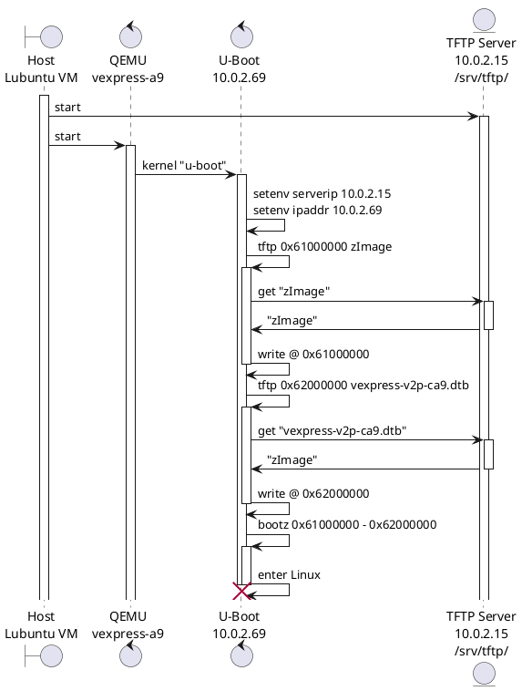

# Bootloader - U-Boot


## Objectives

After this lab you will be able to:

* Compile and install the *U-Boot* bootloader for an emulated *ARM Vexpress Cortex A9* board.

* Use basic *U-Boot* commands.

* Set up *TFTP* communication with the host machine.


## Overview




## Required tools

* Our [*cross-compile toolchain*](toolchain.md)

* Ubuntu packages:

    `device-tree-compiler`
    `libssl-dev`
    `parted`
    `python3-dev`
    `python3-distutils`
    `qemu-system-arm`
    `swig`
    `tftpd-hpa`

    plus those from the previous labs.

* [*Das U-Boot*](https://u-boot.readthedocs.io/), either as:

    * [*git* repository](https://source.denx.de/u-boot/u-boot/)

    * [Source code archive for release `v2023.01`](https://source.denx.de/u-boot/u-boot/-/archive/v2023.01/u-boot-v2023.01.tar.bz2)


## Source code

Enter the folder of this lab, that's going to become our main workspace folder:

```console
$ LAB_PATH="$HOME/embedded-linux-qemu-labs/bootloader"
$ cd $LAB_PATH
```

You can now get *U-Boot* at the suggested version (*git* tag `v2023.01`).

We're going to clone the *git* repository into the home folder, creating a new *branch* named after the *embedded-linux-qemu* tutorial just for convenience.

```console
$ cd $LAB_PATH
$ git clone "https://source.denx.de/u-boot/u-boot"
$ cd u-boot/
$ label="v2023.01"
$ git checkout -b embedded-linux-qemu $label
```

Alternatively, you can directly unpack an archive of the suggested version. This is usually much faster than cloning a big *git* repository, despite losing all the features of a *git* repository.

```console
$ cd $LAB_PATH
$ label="v2023.01"
$ wget "https://source.denx.de/u-boot/u-boot/-/archive/${label}/u-boot-${label}.tar.bz2"
$ tar xfv "u-boot-${label}.tar.bz2"
$ mv u-boot*/ u-boot
```

## Configuration

Get an understanding of *U-Boot*’s configuration and compilation steps by reading its `README` file, and specifically the *Building the Software* section.

*U-Boot* comes with some sample configuration files for officially supported boards, under the `configs` folder, named with a `_defconfig` suffix.

Our board is an *ARM Vexpress Cortex A9*, so let's find it:

```console hl_lines="6"
$ cd $LAB_PATH/u-boot/
$ ls configs/ | grep vexpress
vexpress_aemv8a_juno_defconfig
vexpress_aemv8a_semi_defconfig
vexpress_aemv8r_defconfig
vexpress_ca9x4_defconfig
```

We choose `vexpress_ca9x4_defconfig` as our template. Let's call `make` to make it effective:

```console
$ make vexpress_ca9x4_defconfig
```

## Build

To build *U-Boot*, we need to specify
[the cross-compile toolchain we built](toolchain.md)
by setting a global variable `CROSS_COMPILE`.<br/>
The `export` keyword makes it available also to sub-processes, including `make` and the tools called by it.
We can choose between the full name `arm-training-linux-uclibcgnueabihf-` or the shortened alias `arm-linux-` as the prefix.<br/>
Also, remmeber to parallelize to save time.

```console
$ TC_NAME="arm-training-linux-uclibcgnueabihf"
$ TC_BASE="$HOME/x-tools/$TC_NAME"
$ export PATH="$TC_BASE/bin:$PATH"
$ export CROSS_COMPILE=arm-linux-
$ export MAKEFLAGS=-j$(nproc)
```

We're going to use the `menuconfig` to refine the configuration to suit our needs.

```console
$ cd $LAB_PATH/u-boot/
$ make menuconfig
```

> See: [`menuconfig`](../kb/menuconfig.md)

In `Command line interface` &rarr; `Boot commands`:

* Add support for `bootd` (`CONFIG_CMD_BOOTD`)

In `Command line interface` &rarr; `Environment commands`:

* Add support for `editenv` (`CONFIG_CMD_EDITENV`)

In `Environment`, we will configure *U-Boot* so that it stores its environment inside a file called `uboot.env`
in a *FAT* filesystem on an MMC/SD card (device <code>mmcblk<b><u>0</u></b>p<b><u>1</u></b></code>),
as our emulated machine won’t have flash storage.

* Unset `Environment in flash memory` (`CONFIG_ENV_IS_IN_FLASH`)

* Set `Environment is in a FAT filesystem` (`CONFIG_ENV_IS_IN_FAT`)

* Set `Name of the block device for the environment` (`CONFIG_ENV_FAT_INTERFACE`) = `mmc`

* Set `Device and partition for where to store the environment in FAT` (`CONFIG_ENV_FAT_DEVICE_AND_PART`) = `0:1`

You can now `<Save>` and make a backup copy of this configuration:

```console
$ cp .config ../u-boot.config
```

Install some packages required for compilation:

```console
$ sudo apt install  \
  device-tree-compiler libssl-dev parted  \
  python3-dev python3-distutils swig
```

You can now build the bootloader:

```console
$ make
```

This generates several binaries, including `u-boot` and `u-boot.bin`.<br/>
You can save the former into a backup archive if you wish so:

```console
$ tar cfJv ../u-boot.tar.xz u-boot
```


## Quick test

Back to the lab folder, test that *U-Boot* works. We're going to use *QEMU system*, which emulates a whole target machine (instead of *QEMU user* that only emulates executables).

```console
$ cd $LAB_PATH
$ qemu-system-arm  -nographic  \
  -M vexpress-a9  \
  -m 128M  \
  -kernel u-boot/u-boot
```

* `-M`: emulated machine
* `-m`: amount of memory in the emulated machine
* `-kernel`: allows to load the binary directly into the emulated machine, and run the machine with it.
  This way, you don’t need a *first stage bootloader*. Of course, you don’t have this with real hardware.

**Press a key before the end of the timeout**, to access the *U-Boot prompt*:
You can then type the `help` command, and explore the few commands available.

``` title="QEMU - U-Boot"
Hit any key to stop autoboot:  0
=> help
?         - alias for 'help'
  ...
version   - print monitor, compiler and linker version
```

To exit QEMU, type ++ctrl+a++ then ++h++ to see the available commands.

``` title="QEMU - help"
C-a h    print this help
C-a x    exit emulator
C-a s    save disk data back to file (if -snapshot)
C-a t    toggle console timestamps
C-a b    send break (magic sysrq)
C-a c    switch between console and monitor
C-a C-a  sends C-a
```

One of them is ++ctrl+a++ then ++x++, which allows to **quit** the emulator.


## SD card setup

We now need to add an SD card image to the *QEMU* virtual machine, in particular to get a way to store the *U-Boot environment*.
In later labs, we will also use such storage for other purposes (e.g. to store the *kernel* and *device tree*, *root filesystem* and other filesystems).
The commands that we are going to use will be further explained during the [*Block filesystems*](blockfs.md) lectures.

First, using the `dd` command, create a 1 GB file filled with zeros, called `sd.img`, to be used by *QEMU* as an SD card disk image.

```console
$ cd $LAB_PATH
$ dd if=/dev/zero of=sd.img bs=1M count=1024
```

Now, let’s call the `cfdisk` command to create the partitions that we are going to use:

```console
$ cfdisk sd.img
```

If `cfdisk` asks you to `Select a label type`, choose `dos`, as we don’t really need a `gpt` partition table for our labs.

In the `cfdisk` interface, create three *primary* partitions, starting from the beginning, with the following properties:

* One partition, 64 MB big, with the `FAT16` partition type.<br>
  Mark this partition as *bootable*.

* One partition, 32 MB big, that will be used for the root filesystem.<br/>
  Due to the geometry of the device, the partition might be larger, but it does not matter.<br/>
  Keep the `Linux` partition type.

* One partition filling the remaining space of the SD card image, to be used for the data filesystem.<br/>
  Keep the `Linux` partition type.

Select `Write` when you are done.

> You could've done something similar with a single `parted` issue:
>
> ```console
> $ parted -s sd.img --  \
>     mklabel msdos  \
>     mkpart primary boot fat16 1m 64m  \
>     mkpart primary root ext4 64m 96m  \
>     mkpart primary data ext4 96m -1s  \
>     set 1 boot on
> ```

We're allocating a *loop* driver to emulate block devices from this image and its partitions, by calling `losetup`
(returned <code>loop<b><i>13</i></b></code> in the example):

```console
$ LOOP_DEV=$(sudo losetup -f --show --partscan sd.img)
$ echo $LOOP_DEV
/dev/loop13
```

* `-f`: finds a free *loop* device
* `--show`: shows the *loop* device that it used
* `--partscan`: scans the *loop* device for partitions, and creates additional <code>/dev/loop<b><i>X</i></b>p<b><i>Y</i></b></code> block devices, where:

    * *X*: device index
    * *Y*: partition index

Also run `sudo dmesg` to confirm that 3 partitions were detected for the *loop* device selected by `losetup`:

```console
$ sudo dmesg | grep loop
  ...
[19698.310073] loop13: detected capacity change from 0 to 2097152
[19698.310264]  loop13: p1 p2 p3
```

Last but not least, format partition `1` as `FAT16` with `boot` as label.
The other partitions will be formated later.

```console
$ sudo mkfs.vfat -F 16 -n boot "${LOOP_DEV}p1"
mkfs.fat 4.2 (2021-01-31)
mkfs.fat: Warning: lowercase labels might not work properly on some systems
```

You could've formatted this partition directly within the `parted` example above, with a `parted` command like: `mkfs 1 fat16`.

Now, you can release the *loop* device. If you want, you can create a backup archive.

```console
$ sudo losetup -d $LOOP_DEV
$ tar cfJv sd.img_p1-only.tar.xz sd.img
```

## Test environment

Start *QEMU* again, but this time with the emulated SD card:

```console hl_lines="5"
$ qemu-system-arm  -nographic \
  -M vexpress-a9  \
  -m 128M  \
  -kernel u-boot/u-boot  \
  -sd sd.img
```

Now, in the *U-Boot prompt*, make sure that you can set and store an environment variable:

``` title="QEMU - U-Boot"
=> setenv foo bar
=> saveenv
Saving Environment to FAT... OK
```

Run `reset` to reboot the virtual board, and then check that the `foo` variable is still set:

``` title="QEMU - U-Boot"
=> reset
    ...
Hit any key to stop autoboot:  0
=> printenv foo
foo=bar
```

You can now quit from *QEMU* (++ctrl+a++ then ++x++).


## Networking

To load a kernel in the next lab, we have to setup networking between the host machine and the *QEMU* emulated target machine.<br/>

> See [Host VM - Networking](virtualbox.md#networking) for information about the IP addresses for this lab.

To do so, create a `qemu-myifup` shell script that brings up the network interface between *QEMU* and the host.
It's going to be called by *QEMU* upon spawning of the emulated target machine, with script argument `$1` holding the created network interface.<br/>
Here's the content of the shell script file:

```sh title="$LAB_PATH/qemu-myifup"
#!/bin/sh
HOST_IP="10.0.2.15"
NET_MASK="255.255.255.0"
/sbin/ip a add "$HOST_IP/$NET_MASK" dev "$1"
/sbin/ip link set "$1" up
```

You can dump the content directly to the file with a single command line trick that concatenates (`cat`) a delimited multi-line block of text (between `<<'EOF'` and a standalone `EOF`; quoted to prevent parameter expansion).<br/>
Remember to make the script executable.

```console
$ cd $LAB_PATH
$ cat > qemu-myifup <<'EOF'
#!/bin/sh
HOST_IP="10.0.2.15"
NET_MASK="255.255.255.0"
/sbin/ip a add "$HOST_IP/$NET_MASK" dev "$1"
/sbin/ip link set "$1" up
EOF
$ chmod +x qemu-myifup
```

You need *root* privileges to run *QEMU* this time, because of the need to bring up the
network interface.<br/>
You could put the command into another shell script named `qemu`, for convenience:

```console
$ cat > qemu <<'EOF'
#!/bin/sh
sudo qemu-system-arm  -nographic  \
  -M vexpress-a9  \
  -m 128M  \
  -kernel u-boot/u-boot  \
  -sd sd.img  \
  -net tap,script=./qemu-myifup  \
  -net nic
EOF
$ chmod +x qemu
$ ./qemu
```

Note the new *net* options:

* `-net tap`: creates a software network interface on the host side.
* `-net nic`: adds a network device to the emulated machine.

Meanwhile on the host machine, using the `ip a` command, check that there is now a <code>tap<b><i>N</i></b></code> network interface with the expected host IP address.

```console hl_lines="14 16"
$ ip a
1: lo: <LOOPBACK,UP,LOWER_UP> mtu 65536 qdisc noqueue state UNKNOWN group default qlen 1000
    link/loopback 00:00:00:00:00:00 brd 00:00:00:00:00:00
    inet 127.0.0.1/8 scope host lo
       valid_lft forever preferred_lft forever
    inet6 ::1/128 scope host
       valid_lft forever preferred_lft forever
2: enp0s3: <BROADCAST,MULTICAST,UP,LOWER_UP> mtu 1500 qdisc fq_codel state UP group default qlen 1000
    link/ether 08:00:27:c2:2c:2e brd ff:ff:ff:ff:ff:ff
    inet 10.0.2.15/24 brd 10.0.2.255 scope global dynamic noprefixroute enp0s3
       valid_lft 86241sec preferred_lft 86241sec
    inet6 fe80::ed74:587e:b871:454d/64 scope link noprefixroute
       valid_lft forever preferred_lft forever
3: tap0: <BROADCAST,MULTICAST,UP,LOWER_UP> mtu 1500 qdisc fq_codel state UNKNOWN group default qlen 1000
    link/ether b2:5d:a5:d1:4d:ce brd ff:ff:ff:ff:ff:ff
    inet 10.0.2.15/24 scope global tap0
       valid_lft forever preferred_lft forever
    inet6 fe80::b05d:a5ff:fed1:4dce/64 scope link
       valid_lft forever preferred_lft forever
```

On the *U-Boot* command line, you have to configure the environment variables for networking:
`serverip` for the *host* (*server*) machine, and `ipaddr` for the *target* machine.<br/>
To make these settings permanent, save the environment.

``` title="QEMU - U-Boot"
=> setenv serverip 10.0.2.15
=> setenv ipaddr 10.0.2.69
=> saveenv
```

You can now test the connection to the host, with the `ping` command of *U-Boot*.<br/>
Note that while *U-Boot* can *ping* other machines, it cannot be *ping*ed back, because *U-Boot* doesn't use a complete network stack.

``` title="QEMU - U-Boot"
=> ping $serverip
    ...
host 10.0.2.15 is alive
```

You can leave the *QEMU* instance running for the next paragraph.


## TFTP server

Let’s install a *TFTP* server on your *host* machine*, by the `tftpd-hda` package.

```console
$ sudo apt install tftpd-hpa
$ sudo systemctl restart tftpd-hpa
```

By default, files are stored under the `/srv/tftp/` folder, which should be accessible by the by `tftp` group.<br/>
So, let's add our user to it.

```console
$ sudo mkdir -p /srv/tftp
$ sudo chown -R tftp:tftp /srv/tftp
$ sudo chmod g+rw /srv/tftp/
$ sudo adduser $USER tftp
$ newgrp tftp
```

> The `newgrp tftp` command makes this group available to the current shell without restarting the *host* login session.
> Until the next login session, you have to type this command again for any new shells of the current login session.

To test the TFTP connection, put a small text file in the directory exported through TFTP on your *host* machine, then try to read it back as a TFTP client to check that the server is working properly.

```console
$ echo "Hello, World!" > /srv/tftp/textfile.txt
$ cd $LAB_PATH
$ tftp localhost -v -c get textfile.txt
Connected to localhost (::1), port 69
getting from localhost:textfile.txt to textfile.txt [netascii]
Received 15 bytes in 0.0 seconds [6306 bit/s]
$ cat textfile.txt
Hello, World!
```

Back in *U-Boot* run `bdinfo`, which allows finding out that the RAM starts at `0x60000000`.

``` title="QEMU - U-Boot" hl_lines="4 24"
=> bdinfo
boot_params = 0x60002000
DRAM bank   = 0x00000000
-> start    = 0x60000000
-> size     = 0x08000000
DRAM bank   = 0x00000001
-> start    = 0x80000000
-> size     = 0x00000004
flashstart  = 0x40000000
flashsize   = 0x04000000
flashoffset = 0x00000000
baudrate    = 38400 bps
relocaddr   = 0x67f67000
reloc off   = 0x07767000
Build       = 32-bit
current eth = ethernet@3,02000000
ethaddr     = 52:54:00:12:34:56
IP addr     = 10.0.2.69
fdt_blob    = 0x67fdf590
new_fdt     = 0x00000000
fdt_size    = 0x00000000
lmb_dump_all:
 memory.cnt  = 0x2
 memory[0]      [0x60000000-0x67ffffff], 0x08000000 bytes flags: 0
 memory[1]      [0x80000000-0x80000003], 0x00000004 bytes flags: 0
 reserved.cnt  = 0x2
 reserved[0]    [0x4c000000-0x4c7fffff], 0x00800000 bytes flags: 4
 reserved[1]    [0x67b22c78-0x67ffffff], 0x004dd388 bytes flags: 0
devicetree  = embed
arch_number = 0x000008e0
TLB addr    = 0x67ff0000
irq_sp      = 0x67b26eb0
sp start    = 0x67b26ea0
Early malloc usage: 370 / 400
```

Therefore, we will use the `0x61000000` address to test `tftp`.

From the *U-Boot* prompt, ask the TFTP server that file:

``` title="QEMU - U-Boot" hl_lines="1-2"
=> setenv ram_app_start 0x61000000
=> tftp $ram_app_start textfile.txt
smc911x: detected LAN9118 controller
smc911x: phy initialized
smc911x: MAC 52:54:00:12:34:56
Using ethernet@3,02000000 device
TFTP from server 10.0.2.15; our IP address is 10.0.2.69
Filename 'textfile.txt'.
Load address: 0x61000000
Loading: #
         2 KiB/s
done
Bytes transferred = 14 (e hex)
smc911x: MAC 52:54:00:12:34:56
```

The `tftp` command should have downloaded `textfile.txt` from your development workstation into the board’s memory at location `0x61000000`.<br/>
You can verify that the download was successful by dumping the contents of the memory (`md`, *memory dump*):

``` title="QEMU - U-Boot" hl_lines="2"
=> md $ram_app_start
61000000: 6c6c6548 57202c6f 646c726f 00000a21  Hello, World!...
61000010: 00000000 00000000 00000000 00000000  ................
61000020: 00000000 00000000 00000000 00000000  ................
61000030: 00000000 00000000 00000000 00000000  ................
61000040: 00000000 00000000 00000000 00000000  ................
61000050: 00000000 00000000 00000000 00000000  ................
61000060: 00000000 00000000 00000000 00000000  ................
61000070: 00000000 00000000 00000000 00000000  ................
61000080: 00000000 00000000 00000000 00000000  ................
61000090: 00000000 00000000 00000000 00000000  ................
610000a0: 00000000 00000000 00000000 00000000  ................
610000b0: 00000000 00000000 00000000 00000000  ................
610000c0: 00000000 00000000 00000000 00000000  ................
610000d0: 00000000 00000000 00000000 00000000  ................
610000e0: 00000000 00000000 00000000 00000000  ................
610000f0: 00000000 00000000 00000000 00000000  ................
```

You can now quit from *QEMU* (++ctrl+a++ then ++x++).


## Backup and restore

If you have trouble generating binaries that work properly, or later make a mistake that causes you to lose your bootloader binary, you can find a working version under `$LAB_PATH/data/`, to be copied to `$LAB_PATH/u-boot/`:

```console
$ cd $LAB_PATH
$ mkdir -p u-boot/
$ cp data/u-boot u-boot/u-boot
```


## Licensing

This document is an extension to: [*Embedded Linux System Development - Practical Labs - QEMU Variant*](https://bootlin.com/doc/training/embedded-linux-qemu/)
 &mdash; &copy; 2004-2023, *Bootlin* [https://bootlin.com/](https://bootlin.com), [`CC-BY-SA-3.0`]((https://creativecommons.org/licenses/by-sa/3.0/)) license.

