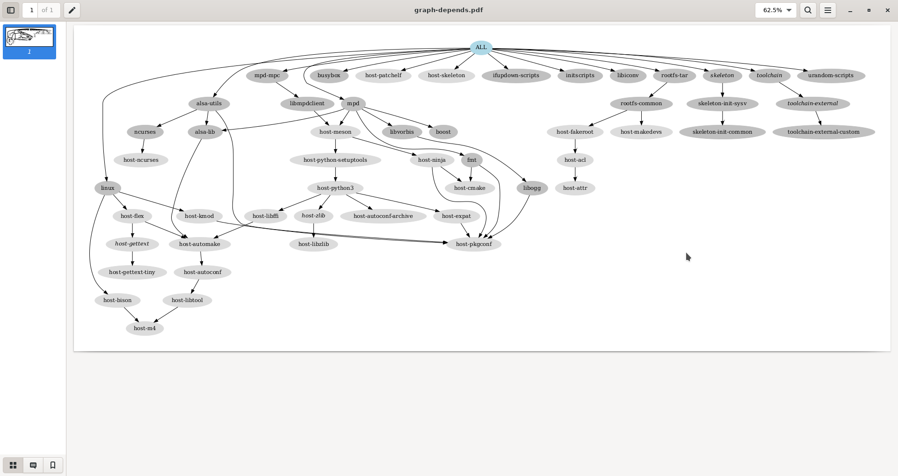

# Buildroot


## Objectives

* discover how a build system is used and how it works, with the example of the Buildroot build system.


Compared to the previous lab, we are going to build a more elaborate system, still containing `alsa-utils` (and of course its `alsa-lib` dependency), but this time using *Buildroot*, an automated build system.

The automated build system will also allow us to add more packages and play real audio on our system, thanks to the [*Music Player Daemon* (`mpd`)](https://www.musicpd.org/) and its `mpc` client.

*Important note: because of the current sound playing issues mentioned before, this lab will be less exhaustive compared to our instructions on real hardware. You should be able to run the commands in the _QEMU_ emulated machine though, proving that the tools were built correctly. So, we will build tools like mpd and mpc, but won’t test them because of the absence of sound.*


## Required tools

* Our [*cross-compile toolchain*](toolchain.md)

* Ubuntu packages:

    `evince`
    `graphviz`

    plus those from the previous labs.

* [*Buildroot*](https://buildroot.org/), either as:

    * [*git* repository](https://git.buildroot.net/buildroot/) tag `v2022.02`

    * [Source code archive for release `v2022.02`](https://git.buildroot.net/buildroot/snapshot/buildroot-2022.02.tar.bz2)


## Source code

The official *Buildroot* website is available at [https://buildroot.org/](https://buildroot.org/).<br/>
Let's clone the *git* repository, branching the `2022.02` release, which is a *LTS* (*Long Term Support*, we're just sticking to the original one), naming after this lab.

```console
$ LAB_PATH="$HOME/embedded-linux-qemu-labs/buildroot"
$ cd $LAB_PATH
$ label="2022.02"
$ git clone https://git.buildroot.net/buildroot/
$ cd buildroot/
$ git checkout -b embedded-linux-qemu $label
```

Alternatively, you can download an archived version.

```console
$ LAB_PATH="$HOME/embedded-linux-qemu-labs/buildroot"
$ cd $LAB_PATH
$ label="2022.02"
$ wget "https://git.buildroot.net/buildroot/snapshot/buildroot-${label}.tar.bz2"
$ tar xfv "buildroot-${label}.tar.bz2"
$ mv buildroot*/ buildroot
$ cd buildroot/
```

Several subdirectories or files are visible. The most important ones are:

* `boot` contains the *Makefiles* and configuration items related to the compilation of common bootloaders (*GRUB*, *U-Boot*, *Barebox*, etc.)

* `board` contains board specific configurations and *root* filesystem *overlays*.

* `configs` contains a set of predefined configurations, similar to the concept of *defconfig* in the kernel.

* `docs` contains the documentation for *Buildroot*.

* `fs` contains the code used to generate the various *root* filesystem image formats.

* `linux` contains the *Makefile* and configuration items related to the compilation of the Linux kernel.

* `Makefile` is the main *Makefile* that we will use to use *Buildroot*: everything works through *Makefiles* in Buildroot;

* `package` is a directory that contains all the *Makefiles*, patches, and configuration items to compile the *user space* applications and libraries of your embedded Linux system.<br/>
  Have a look at various subdirectories and see what they contain.

* `system` contains the root filesystem skeleton and the *device tables* used for a static `/dev`.

* `toolchain` contains the *Makefiles*, patches and configuration items to generate the cross-compiling toolchain.


## Configuration

In our case, we would like to:

* Generate an embedded Linux system for ARM.

* Use an already existing external toolchain instead of having *Buildroot* generating one for us.

* Compile the Linux kernel and deploy its modules in the *root* filesystem.

* Integrate *BusyBox*, `alsa-utils`, `mpd`, `mpc` and `evtest` in our embedded Linux system.

* Integrate the target filesystem into a *tarball*.

To run the configuration utility of *Buildroot*, simply run:

```console
$ make menuconfig
```

Set the following options. Don’t hesitate to press the `Help` button whenever you need more details about a given option!


In `Target options`:

* `Target Architecture` = `ARM (little endian)`.

* `Target Architecture Variant` = `cortex-A9`.

* Enable `NEON SIMD extension support`.

* Enable `VFP extension support`.

* `Target ABI` = `EABIhf`.

* `Floating point strategy` = `VFPv3-D16`.


In `Kernel`:

* Enable `Linux Kernel`.

* `Defconfig name` = `vexpress`.

* Enable `Build a Device Tree Blob (DTB)`.

* `In-tree Device Tree Source file names` = `vexpress-v2p-ca9`.


In `Toolchain`:

* `Toolchain type` = `External toolchain`.

* `Toolchain` = `Custom toolchain`.

* `Toolchain path` = `$(HOME)/x-tools/arm-traininglinux-uclibcgnueabihf`, which is the one we built.

* `External toolchain gcc version` = `11.x`.

* `External toolchain kernel headers series` = `5.15.x`.

* `External toolchain C library` = `uClibc/uClibc-ng`.

* Enable `Toolchain has WCHAR support?`.

* Enable `Toolchain has SSP support?`.

* Enable `Toolchain has C++ support?`.


In `Target packages`:

* Keep `BusyBox (default version)` and keep the *BusyBox* configuration proposed by *Buildroot*.

* Under `Audio and video applications`:

    * Enable `alsa-utils`, and in the submenu:

        * Enable `alsamixer`. You will be able to test this application too, and that will also pull the `ncurses` library, which we will also use in the next lab.

        * Enable `speaker-test`.

    * Enable `mpd`, and in the submenu:

        * Keep only `alsa`, `vorbis` and `tcp sockets`.

    * Enable* `mpd-mpc`.


In `Filesystem images`:

* Enable `tar the root filesystem`.


Exit the `menuconfig` interface saving into the usual `.config` file. Also make a backup copy for reference.

```console
$ cp .config ../buildroot.config
```


## Build

Just run the canonical `make`:

```console
$ make
```

*Buildroot* will first create a small environment with the external toolchain, then download,
extract, configure, compile, and install each component of the embedded system.

All the compilation has taken place in the `output/` subdirectory. Let’s explore its content:

* `build` is the directory in which each component built by *Buildroot* is extracted, and where the build actually takes place.

* `host` is the directory where *Buildroot* installs some components for the host.<br/>
  As *Buildroot* doesn’t want to depend on too many things installed in the developer machines, it installs some tools needed to compile the packages for the target.<br/>
  In our case it installed `pkg-config` (since the version of the host may be ancient) and tools to generate the root filesystem image (`genext2fs`, `makedevs`, `fakeroot`).

* `images` which contains the final images produced by *Buildroot*. In our case it contains a *tarball* of the filesystem, called `rootfs.tar`, plus the compressed kernel and *DTB* (*Device Tree Binary*).<br/>
  Depending on the configuration, there could also a bootloader binary or a full SD card image.

* `staging`, which contains the "build" space of the target system, all the target libraries, with headers and documentation.<br/>
  It also contains the system headers and the C library, which in our case have been copied from the cross-compiling toolchain.

* `target` is the target *root* filesystem. All the applications and libraries, usually *stripped*, are
installed in this directory.<br/>
  However, it cannot be used directly as the *root* filesystem, as all the device files are missing: it is not possible to create them without being *root*, and *Buildroot* has a policy of not running anything as *root*.


## Run the generated system

Go back to the `$HOME/embedded-linux-qemu-labs/buildroot/` directory.<br/>
Create a new `nfsroot` directory that is going to hold our system, exported over NFS.<br/>
Go into this directory, and untar the *rootfs*.

```console
$ mkdir -p "$LAB_PATH/nfsroot/"
$ cd "$LAB_PATH/nfsroot/"
$ tar xfv "../buildroot/output/images/rootfs.tar"
```

Add this new `nfsroot` directory to the list of directories exported by NFS in `/etc/exports`.
You could just replace the *symlink* we used for *BusyBox*, pointing instead to this new `nfsroot`.<br/>

```console
$ sudo rm -f /srv/nfs
$ sudo ln -snv "$LAB_PATH/nfsroot/" /srv/nfs
'/srv/nfs' -> '/home/me/embedded-linux-qemu-labs/buildroot/nfsroot/'
$ sudo chown -R tftp:tftp /srv/nfs
$ sudo exportfs -ar
$ sudo systemctl restart nfs-kernel-server
```

Also update the kernel and *Device Tree Binaries* used by your board, from the ones compiled by *Buildroot* in `output/images/`.

```console
$ cd "$LAB_PATH/buildroot/output/"
$ cp images/zImage /srv/tftp/zImage-buildroot
$ cp images/zImage /srv/tftp/zImage
$ cp $(find . -name "vexpress-v2p-ca9.dtb") /srv/tftp/
```

You should restore *U-Boot* to work with TFTP and NFS. Run *QEMU*, press a key to reach the *U-Boot* prompt, and restore the environment variables. Finally, reset the board.

```console title="QEMU - Buildroot"
=> setenv bootcmd "tftp 0x61000000 zImage;  tftp 0x62000000 vexpress-v2p-ca9.dtb;  bootz 0x61000000 - 0x62000000"
=> setenv bootargs console=ttyAMA0 root=/dev/nfs ip=${ipaddr}::${serverip}:${netmask}:: nfsroot=${serverip}:${servernfs},nfsvers=3,tcp rw
=> reset
```

You should now be able to log in (`root` account, no password) to reach a shell.<br/>

You can run `speaker-test` to check that this application works; note that the sound might stutter within *QEMU*.

```console title="QEMU - Buildroot"
# speaker-test -t sine -l 1

speaker-test 1.2.6

Playback device is default
Stream parameters are 48000Hz, S16_LE, 1 channels
Sine wave rate is 440.0000Hz
Rate set to 48000Hz (requested 48000Hz)
Buffer size range from 256 to 16384
Period size range from 64 to 1024
Using max buffer size 16384
Periods = 4
was set period_size = 1024
was set buffer_size = 16384
 0 - Front Left
Time per period = 3.791015
```

You can also test the `alsamixer` command too.

<!--
Custom code block formatting, because otherwise it would render with mixed font families.
The default "monospace" font should make it more portable.
-->
<div class="language-console highlight"><span class="filename">QEMU - Buildroot</span>
<pre><code><span class="gp"># </span>alsamixer<span class="go" style="font-family: monospace !important">
┌────────────────────────────── AlsaMixer v1.2.6 ──────────────────────────────┐
│ Card: ARM AC'97 Interface                            F1:  Help               │
│ Chip: National Semiconductor LM4549                  F2:  System information │
│ View: F3:[Playback] F4: Capture  F5: All             F6:  Select sound card  │
│ Item: Master [dB gain: 0.00, 0.00]                   Esc: Exit               │
│                                                                              │
│     ┌──┐     ┌──┐     ┌──┐              ┌──┐              ┌──┐     ┌──┐      │
│     │▒▒│     │▒▒│     │▒▒│              │▒▒│              │  │     │  │      │
│     │▒▒│     │▒▒│     │▒▒│              │▒▒│              │  │     │  │      │
│     │▒▒│     │▒▒│     │▒▒│              │▒▒│              │  │     │  │      >
│     │▒▒│     │▒▒│     │▒▒│              │▒▒│              │  │     │  │      >
│     │▒▒│     │▒▒│     │▒▒│              │▒▒│              │  │     │  │      >
│     │▒▒│     │▒▒│     │▒▒│              │▒▒│              │  │     │  │      >
│     │▒▒│     │▒▒│     │▒▒│              │▒▒│              │  │     │  │      >
│     │▒▒│     │▒▒│     │▒▒│              │▒▒│              │  │     │  │      >
│     │▒▒│     │▒▒│     │▒▒│              │▒▒│              │  │     │  │      >
│     │▒▒│     │▒▒│     │▒▒│              │▒▒│              │  │     │  │      │
│     │▒▒│     │▒▒│     │▒▒│              │▒▒│              │  │     │  │      │
│     ├──┤     ├──┤     ├──┤     ┌──┐     ├──┤    pre 3D    ├──┤     ├──┤      │
│     │MM│     │MM│     │MM│     │MM│     │MM│              │MM│     │MM│      │
│     └──┘     └──┘     └──┘     └──┘     └──┘              └──┘     └──┘      │
│   100<>100 100<>100 100<>100          100<>100            0<>0     0<>0      │
│  < Master >Master M Headphon 3D Contr   PCM    PCM Out    Line      CD       │
└──────────────────────────────────────────────────────────────────────────────┘</code></pre></div>

By running the `ps` command, you may also check whether the `mpd` server was started on your system.

```console title="QEMU - Buildroot" hl_lines="2"
# ps | grep mpd
  105 root     /usr/bin/mpd
  134 root     grep mpd
```


## Analyzing dependencies

It’s always useful to understand the dependencies drawn by the packages we build. First we need to install Graphviz and a PDF viewer:

```console
$ sudo apt install evince graphviz
```

Now, let’s use *Buildroot*'s target to generate a dependency graph. Once generated, it can ve viewed for visual inspection.

```console
$ cd "$LAB_PATH/buildroot/"
$ make graph-depends
Getting dependency tree...
dot  -Tpdf \
        -o /home/me/embedded-linux-qemu-labs/buildroot/buildroot/output/graphs/graph-depends.pdf \
        /home/me/embedded-linux-qemu-labs/buildroot/buildroot/output/graphs/graph-depends.dot
$ evince output/graphs/graph-depends.pdf
```

In particular, you can see that adding *MPD* and its client required to compile *Meson* for the
host, and in turn, *Python 3* for the host too. This substantially contributed to the build time.




## Backup and restore

```console
$ cd "$LAB_PATH/../bootloader/"
$ tar cfJv "$LAB_PATH/buildroot-sd.img.tar.xz" sd.img
$ cd "$LAB_PATH/nfsroot/"
$ find . -depth -print0 | cpio -ocv0 | xz > "$LAB_PATH/nfsroot-buildroot.cpio.xz"
$ cd "$LAB_PATH/buildroot/output/images/"
$ tar cfJv "$LAB_PATH/rootfs-buildroot.tar.xz" rootfs.tar
$ cd /srv/tftp/
$ tar cfJv "$LAB_PATH/buildroot-tftp.tar.xz" zImage vexpress-v2p-ca9.dtb
```


## Licensing

This document is an extension to: [*Embedded Linux System Development - Practical Labs - QEMU Variant*](https://bootlin.com/doc/training/embedded-linux-qemu/)
 &mdash; &copy; 2004-2023, *Bootlin* [https://bootlin.com/](https://bootlin.com), [`CC-BY-SA-3.0`]((https://creativecommons.org/licenses/by-sa/3.0/)) license.
